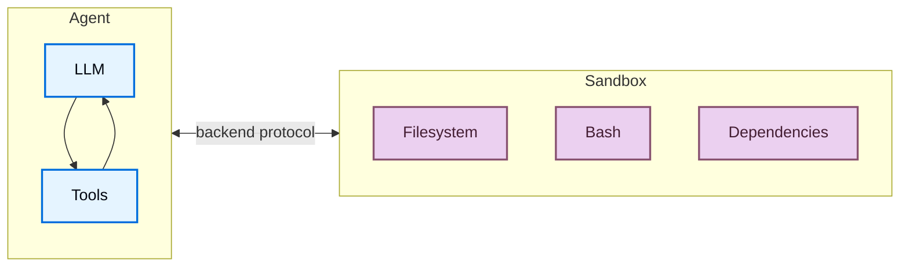
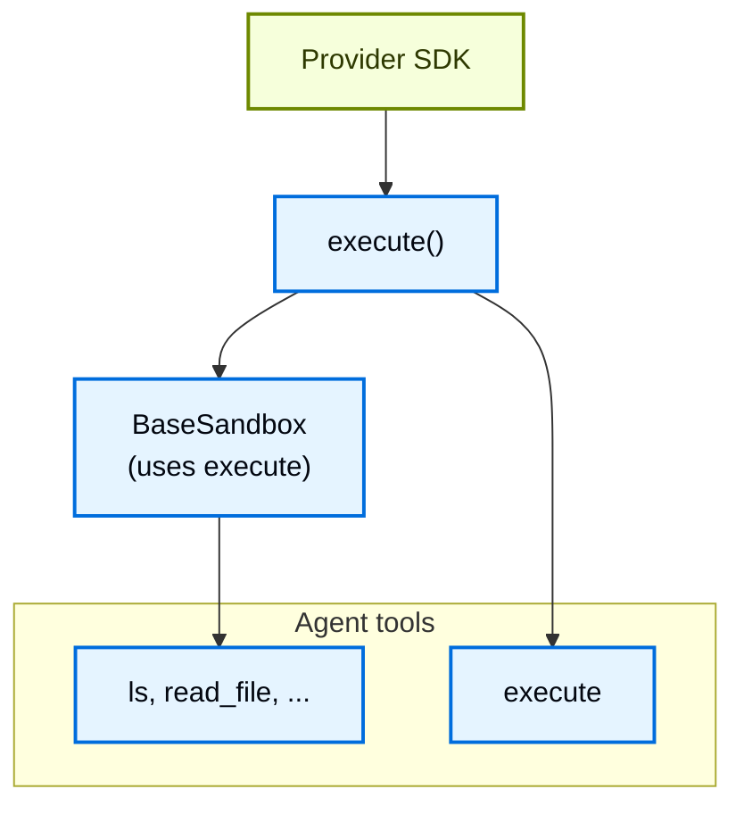
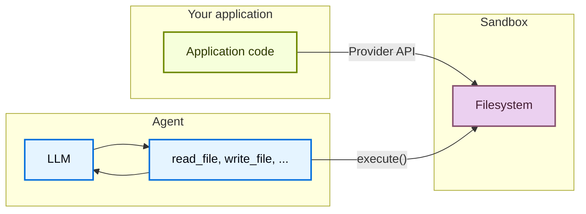

# Sandboxes

> Execute code in isolated environments with sandbox backends

Agents generate code, interact with filesystems, and run shell commands. Because you can't predict what an agent might do, it's important that its environment is isolated so it can't access credentials, files, or the network. Sandboxes provide this isolation by creating a boundary between the agent's execution environment and your host system.

In Deep Agents, **sandboxes are [backends](backends.md)** that define the environment where the agent operates. Unlike other backends (State, Filesystem, Store) which only expose file operations, sandbox backends also give the agent an `execute` tool for running shell commands. When you configure a sandbox backend, the agent gets:

* All standard filesystem tools (`ls`, `read_file`, `write_file`, `edit_file`, `glob`, `grep`)

* The `execute` tool for running arbitrary shell commands in the sandbox

* A secure boundary that protects your host system



## Why use sandboxes?

Sandboxes are used for security.
They let agents execute arbitrary code, access files, and use the network without compromising your credentials, local files, or host system.
This isolation is essential when agents run autonomously.

Sandboxes are especially useful for:

* Coding agents: Agents that run autonomously can use shell, git, clone repositories (many providers offer native git APIs, e.g., [Daytona's git operations](https://www.daytona.io/docs/en/git-operations/)), and run Docker-in-Docker for build and test pipelines
* Data analysis agents: Load files, install data analysis libraries (pandas, numpy, etc.), run statistical calculations, and create outputs like PowerPoint presentations in a safe, isolated environment

> [!TIP]
> **Using Deep Agents Code?** Deep Agents Code has built-in sandbox support via the `--sandbox` flag. See [Use remote sandboxes](../../deepagents/code/remote-sandboxes.md) for Deep Agents Code-specific setup, flags (`--sandbox-id`, `--sandbox-setup`), and examples.

> [!NOTE]
> **If you're looking for LangSmith sandboxes:** LangSmith provides first-party managed sandboxes you can use directly from the LangSmith UI or SDK without a third-party account required. For managed sandbox resources, snapshots, service URLs, and the auth proxy, refer to [LangSmith Sandboxes](../../langsmith/sandboxes.md).

## Basic usage

These examples assume you have already created a sandbox/devbox using the provider's SDK and have credentials set up. For signup, authentication, and provider-specific lifecycle details, see [Available providers](#available-providers).

```ts
import { createDeepAgent, LangSmithSandbox } from "deepagents";
import { ChatAnthropic } from "@langchain/anthropic";
import { SandboxClient } from "langsmith/sandbox";

const client = new SandboxClient();
const lsSandbox = await client.createSandbox();

try {
  const agent = createDeepAgent({
    model: new ChatAnthropic({ model: "claude-opus-4-8" }),
    systemPrompt: "You are a coding assistant with sandbox access.",
    backend: new LangSmithSandbox({ sandbox: lsSandbox }),
  });

  const result = await agent.invoke({
    messages: [
      {
        role: "user",
        content: "Create a hello world Python script and run it",
      },
    ],
  });
  void result;
} finally {
  await client.deleteSandbox(lsSandbox.name);
}
```

#### [View example trace](https://smith.langchain.com/public/736ab6fc-a61c-4ee8-bfbc-dde6bd19382c/r)
Open a public LangSmith run for this example.

> [!TIP]
> [LangSmith](https://smith.langchain.com?utm_source=docs\&utm_medium=cta\&utm_campaign=langsmith-signup\&utm_content=oss-deepagents-sandboxes) traces show which shell commands ran inside a sandbox and how the agent used filesystem tools. Follow the [observability quickstart](../../langsmith/observability-quickstart.md) to get set up. For managed sandbox hosting, see [LangSmith Sandboxes](../../langsmith/sandboxes.md).
>
> We recommend you also set up [LangSmith Engine](../../langsmith/engine.md), which monitors your traces, detects issues, and proposes fixes.

## Available providers

For provider-specific setup, authentication, and lifecycle details, see [sandbox integrations](../integrations/sandboxes.md).

## Lifecycle and scoping

Most applications choose either one sandbox per [thread](../../langsmith/use-threads.md) (thread-scoped) or one shared sandbox for every thread on the same [assistant](../../langsmith/assistants.md) (assistant-scoped).

Sandboxes consume resources and cost money until they are shut down. Make sure you shut sandboxes down once they are no longer in use.

For the full lifecycle table, async [graph factory](../../langsmith/graph-rebuild.md) notes, TTL behavior, LangGraph Deployment wiring, and client-side examples, see [Sandbox lifecycle](going-to-production.md#lifecycle) in Going to production.

### Thread-scoped (default)

Each conversation gets its own sandbox. The first run creates it; follow-up turns on the same thread reuse it. When the thread ends or the sandbox TTL expires, the environment goes away. Store the mapping with sandbox names or metadata as in the following example so each run resolves to the same sandbox.

> [!TIP]
> When users can return after idle time, configure a TTL on the sandbox so the provider deletes or archives idle environments automatically.

**Google**

```ts
import { createDeepAgent, LangSmithSandbox } from "deepagents";
import { SandboxClient } from "langsmith/sandbox";
import type { LangGraphRunnableConfig } from "@langchain/langgraph";

const client = new SandboxClient();

export async function agent(config: LangGraphRunnableConfig) {
  const threadId = config.configurable?.thread_id as string; // [!code highlight]
  const sandboxName = `thread-${threadId}`;
  const existing = (await client.listSandboxes()).filter(
    (sb) => sb.name === sandboxName,
  );
  const lsSandbox =
    existing[0] ??
    (await client.createSandbox({
      name: sandboxName,
      idleTtlSeconds: 3600, // TTL: clean up when idle
    }));
  return createDeepAgent({
    model: "google-genai:gemini-3.6-flash",
    backend: new LangSmithSandbox({ sandbox: lsSandbox }),
  });
}
```

**OpenAI**

```ts
import { createDeepAgent, LangSmithSandbox } from "deepagents";
import { SandboxClient } from "langsmith/sandbox";
import type { LangGraphRunnableConfig } from "@langchain/langgraph";

const client = new SandboxClient();

export async function agent(config: LangGraphRunnableConfig) {
  const threadId = config.configurable?.thread_id as string; // [!code highlight]
  const sandboxName = `thread-${threadId}`;
  const existing = (await client.listSandboxes()).filter(
    (sb) => sb.name === sandboxName,
  );
  const lsSandbox =
    existing[0] ??
    (await client.createSandbox({
      name: sandboxName,
      idleTtlSeconds: 3600, // TTL: clean up when idle
    }));
  return createDeepAgent({
    model: "openai:gpt-5.5",
    backend: new LangSmithSandbox({ sandbox: lsSandbox }),
  });
}
```

**Anthropic**

```ts
import { createDeepAgent, LangSmithSandbox } from "deepagents";
import { SandboxClient } from "langsmith/sandbox";
import type { LangGraphRunnableConfig } from "@langchain/langgraph";

const client = new SandboxClient();

export async function agent(config: LangGraphRunnableConfig) {
  const threadId = config.configurable?.thread_id as string; // [!code highlight]
  const sandboxName = `thread-${threadId}`;
  const existing = (await client.listSandboxes()).filter(
    (sb) => sb.name === sandboxName,
  );
  const lsSandbox =
    existing[0] ??
    (await client.createSandbox({
      name: sandboxName,
      idleTtlSeconds: 3600, // TTL: clean up when idle
    }));
  return createDeepAgent({
    model: "anthropic:claude-sonnet-5",
    backend: new LangSmithSandbox({ sandbox: lsSandbox }),
  });
}
```

**OpenRouter**

```ts
import { createDeepAgent, LangSmithSandbox } from "deepagents";
import { SandboxClient } from "langsmith/sandbox";
import type { LangGraphRunnableConfig } from "@langchain/langgraph";

const client = new SandboxClient();

export async function agent(config: LangGraphRunnableConfig) {
  const threadId = config.configurable?.thread_id as string; // [!code highlight]
  const sandboxName = `thread-${threadId}`;
  const existing = (await client.listSandboxes()).filter(
    (sb) => sb.name === sandboxName,
  );
  const lsSandbox =
    existing[0] ??
    (await client.createSandbox({
      name: sandboxName,
      idleTtlSeconds: 3600, // TTL: clean up when idle
    }));
  return createDeepAgent({
    model: "openrouter:z-ai/glm-5.2",
    backend: new LangSmithSandbox({ sandbox: lsSandbox }),
  });
}
```

**Fireworks**

```ts
import { createDeepAgent, LangSmithSandbox } from "deepagents";
import { SandboxClient } from "langsmith/sandbox";
import type { LangGraphRunnableConfig } from "@langchain/langgraph";

const client = new SandboxClient();

export async function agent(config: LangGraphRunnableConfig) {
  const threadId = config.configurable?.thread_id as string; // [!code highlight]
  const sandboxName = `thread-${threadId}`;
  const existing = (await client.listSandboxes()).filter(
    (sb) => sb.name === sandboxName,
  );
  const lsSandbox =
    existing[0] ??
    (await client.createSandbox({
      name: sandboxName,
      idleTtlSeconds: 3600, // TTL: clean up when idle
    }));
  return createDeepAgent({
    model: "fireworks:accounts/fireworks/models/glm-5p2",
    backend: new LangSmithSandbox({ sandbox: lsSandbox }),
  });
}
```

**Baseten**

```ts
import { createDeepAgent, LangSmithSandbox } from "deepagents";
import { SandboxClient } from "langsmith/sandbox";
import type { LangGraphRunnableConfig } from "@langchain/langgraph";

const client = new SandboxClient();

export async function agent(config: LangGraphRunnableConfig) {
  const threadId = config.configurable?.thread_id as string; // [!code highlight]
  const sandboxName = `thread-${threadId}`;
  const existing = (await client.listSandboxes()).filter(
    (sb) => sb.name === sandboxName,
  );
  const lsSandbox =
    existing[0] ??
    (await client.createSandbox({
      name: sandboxName,
      idleTtlSeconds: 3600, // TTL: clean up when idle
    }));
  return createDeepAgent({
    model: "baseten:zai-org/GLM-5.2",
    backend: new LangSmithSandbox({ sandbox: lsSandbox }),
  });
}
```

**Ollama**

```ts
import { createDeepAgent, LangSmithSandbox } from "deepagents";
import { SandboxClient } from "langsmith/sandbox";
import type { LangGraphRunnableConfig } from "@langchain/langgraph";

const client = new SandboxClient();

export async function agent(config: LangGraphRunnableConfig) {
  const threadId = config.configurable?.thread_id as string; // [!code highlight]
  const sandboxName = `thread-${threadId}`;
  const existing = (await client.listSandboxes()).filter(
    (sb) => sb.name === sandboxName,
  );
  const lsSandbox =
    existing[0] ??
    (await client.createSandbox({
      name: sandboxName,
      idleTtlSeconds: 3600, // TTL: clean up when idle
    }));
  return createDeepAgent({
    model: "ollama:north-mini-code-1.0",
    backend: new LangSmithSandbox({ sandbox: lsSandbox }),
  });
}
```

### Assistant-scoped

Every thread on the same assistant reuses one sandbox. Files, installed packages, and cloned repositories persist across conversations.

> [!WARNING]
> Assistant-scoped sandboxes accumulate in-sandbox state over time. Configure a TTL with your sandbox provider, use snapshots to reset periodically, or implement cleanup logic so disk and memory do not grow without bound.

**Google**

```ts
import { createDeepAgent, LangSmithSandbox } from "deepagents";
import { SandboxClient } from "langsmith/sandbox";
import type { LangGraphRunnableConfig } from "@langchain/langgraph";

const client = new SandboxClient();

export async function agent(config: LangGraphRunnableConfig) {
  const assistantId = config.configurable?.assistant_id as string; // [!code highlight]
  const sandboxName = `assistant-${assistantId}`;
  const existing = (await client.listSandboxes()).filter(
    (sb) => sb.name === sandboxName,
  );
  const lsSandbox =
    existing[0] ??
    (await client.createSandbox({
      name: sandboxName,
    }));
  return createDeepAgent({
    model: "google-genai:gemini-3.6-flash",
    backend: new LangSmithSandbox({ sandbox: lsSandbox }),
  });
}
```

**OpenAI**

```ts
import { createDeepAgent, LangSmithSandbox } from "deepagents";
import { SandboxClient } from "langsmith/sandbox";
import type { LangGraphRunnableConfig } from "@langchain/langgraph";

const client = new SandboxClient();

export async function agent(config: LangGraphRunnableConfig) {
  const assistantId = config.configurable?.assistant_id as string; // [!code highlight]
  const sandboxName = `assistant-${assistantId}`;
  const existing = (await client.listSandboxes()).filter(
    (sb) => sb.name === sandboxName,
  );
  const lsSandbox =
    existing[0] ??
    (await client.createSandbox({
      name: sandboxName,
    }));
  return createDeepAgent({
    model: "openai:gpt-5.5",
    backend: new LangSmithSandbox({ sandbox: lsSandbox }),
  });
}
```

**Anthropic**

```ts
import { createDeepAgent, LangSmithSandbox } from "deepagents";
import { SandboxClient } from "langsmith/sandbox";
import type { LangGraphRunnableConfig } from "@langchain/langgraph";

const client = new SandboxClient();

export async function agent(config: LangGraphRunnableConfig) {
  const assistantId = config.configurable?.assistant_id as string; // [!code highlight]
  const sandboxName = `assistant-${assistantId}`;
  const existing = (await client.listSandboxes()).filter(
    (sb) => sb.name === sandboxName,
  );
  const lsSandbox =
    existing[0] ??
    (await client.createSandbox({
      name: sandboxName,
    }));
  return createDeepAgent({
    model: "anthropic:claude-sonnet-5",
    backend: new LangSmithSandbox({ sandbox: lsSandbox }),
  });
}
```

**OpenRouter**

```ts
import { createDeepAgent, LangSmithSandbox } from "deepagents";
import { SandboxClient } from "langsmith/sandbox";
import type { LangGraphRunnableConfig } from "@langchain/langgraph";

const client = new SandboxClient();

export async function agent(config: LangGraphRunnableConfig) {
  const assistantId = config.configurable?.assistant_id as string; // [!code highlight]
  const sandboxName = `assistant-${assistantId}`;
  const existing = (await client.listSandboxes()).filter(
    (sb) => sb.name === sandboxName,
  );
  const lsSandbox =
    existing[0] ??
    (await client.createSandbox({
      name: sandboxName,
    }));
  return createDeepAgent({
    model: "openrouter:z-ai/glm-5.2",
    backend: new LangSmithSandbox({ sandbox: lsSandbox }),
  });
}
```

**Fireworks**

```ts
import { createDeepAgent, LangSmithSandbox } from "deepagents";
import { SandboxClient } from "langsmith/sandbox";
import type { LangGraphRunnableConfig } from "@langchain/langgraph";

const client = new SandboxClient();

export async function agent(config: LangGraphRunnableConfig) {
  const assistantId = config.configurable?.assistant_id as string; // [!code highlight]
  const sandboxName = `assistant-${assistantId}`;
  const existing = (await client.listSandboxes()).filter(
    (sb) => sb.name === sandboxName,
  );
  const lsSandbox =
    existing[0] ??
    (await client.createSandbox({
      name: sandboxName,
    }));
  return createDeepAgent({
    model: "fireworks:accounts/fireworks/models/glm-5p2",
    backend: new LangSmithSandbox({ sandbox: lsSandbox }),
  });
}
```

**Baseten**

```ts
import { createDeepAgent, LangSmithSandbox } from "deepagents";
import { SandboxClient } from "langsmith/sandbox";
import type { LangGraphRunnableConfig } from "@langchain/langgraph";

const client = new SandboxClient();

export async function agent(config: LangGraphRunnableConfig) {
  const assistantId = config.configurable?.assistant_id as string; // [!code highlight]
  const sandboxName = `assistant-${assistantId}`;
  const existing = (await client.listSandboxes()).filter(
    (sb) => sb.name === sandboxName,
  );
  const lsSandbox =
    existing[0] ??
    (await client.createSandbox({
      name: sandboxName,
    }));
  return createDeepAgent({
    model: "baseten:zai-org/GLM-5.2",
    backend: new LangSmithSandbox({ sandbox: lsSandbox }),
  });
}
```

**Ollama**

```ts
import { createDeepAgent, LangSmithSandbox } from "deepagents";
import { SandboxClient } from "langsmith/sandbox";
import type { LangGraphRunnableConfig } from "@langchain/langgraph";

const client = new SandboxClient();

export async function agent(config: LangGraphRunnableConfig) {
  const assistantId = config.configurable?.assistant_id as string; // [!code highlight]
  const sandboxName = `assistant-${assistantId}`;
  const existing = (await client.listSandboxes()).filter(
    (sb) => sb.name === sandboxName,
  );
  const lsSandbox =
    existing[0] ??
    (await client.createSandbox({
      name: sandboxName,
    }));
  return createDeepAgent({
    model: "ollama:north-mini-code-1.0",
    backend: new LangSmithSandbox({ sandbox: lsSandbox }),
  });
}
```

For manual create, execute, and teardown outside a graph factory, see [Basic usage](#basic-usage) and [sandbox integrations](../integrations/sandboxes.md) for provider-specific APIs.

## Integration patterns

There are two architecture patterns for integrating agents with sandboxes, based on where the agent runs.

### Agent in sandbox pattern

The agent runs inside the sandbox and you communicate with it over the network. You build a Docker or VM image with your agent framework pre-installed, run it inside the sandbox, and connect from outside to send messages.

Benefits:

* ✅ Mirrors local development closely.
* ✅ Tight coupling between agent and environment.

Trade-offs:

* 🔴 API keys must live inside the sandbox (security risk).
* 🔴 Updates require rebuilding images.
* 🔴 Requires infrastructure for communication (WebSocket or HTTP layer).

To run an agent in a sandbox, build an image and install deepagents on it.

```dockerfile
FROM python:3.11
RUN pip install deepagents-code
```

Then run the agent inside the sandbox.
To use the agent inside the sandbox you have to add additional infrastructure to handle communication between your application and the agent inside the sandbox.

### Sandbox as tool pattern

The agent runs on your machine or server. When it needs to execute code, it calls sandbox tools (such as `execute`, `read_file`, or `write_file`) which invoke the provider's APIs to run operations in a remote sandbox.

Benefits:

* ✅ Update agent code instantly without rebuilding images.
* ✅ Cleaner separation between agent state and execution.
  * API keys stay outside the sandbox.
  * Sandbox failures don't lose agent state.
  * Option to run tasks in multiple sandboxes in parallel.
* ✅ Pay only for execution time.

Trade-offs:

* 🔴 Network latency on each execution call.

```ts
import "dotenv/config";
import { createDeepAgent, LangSmithSandbox } from "deepagents";
import { SandboxClient } from "langsmith/sandbox";

// Can also do this with Deno, Daytona, E2B, Modal, or Runloop
const client = new SandboxClient();
const lsSandbox = await client.createSandbox();

const agent = createDeepAgent({
  backend: new LangSmithSandbox({ sandbox: lsSandbox }),
  systemPrompt:
    "You are a coding assistant with sandbox access. You can create and run code in the sandbox.",
});

try {
  const result = await agent.invoke({
    messages: [
      {
        role: "user",
        content: "Create a hello world Python script and run it",
      },
    ],
  });
  const lastMessage = result.messages[result.messages.length - 1];
  console.log(
    typeof lastMessage.content === "string"
      ? lastMessage.content
      : String(lastMessage.content),
  );
} finally {
  await client.deleteSandbox(lsSandbox.name);
}
```

#### [View example trace](https://smith.langchain.com/public/8542aece-b18a-4f24-8ff1-3bc1a0737104/r)
Open a public LangSmith run for this example.

The examples in this doc use the sandbox as a tool pattern.
Choose the agent in sandbox pattern when your provider's SDK handles the communication layer and you want production to mirror local development.
Choose the sandbox as tool pattern when you need to iterate quickly on agent logic, keep API keys outside the sandbox, or prefer cleaner separation of concerns.

## How sandboxes work

### Isolation boundaries

All sandbox providers protect your host system from the agent's filesystem and shell operations. The agent cannot read your local files, access environment variables on your machine, or interfere with other processes. However, sandboxes alone do **not** protect against:

* **Context injection**: An attacker who controls part of the agent's input can instruct it to run arbitrary commands inside the sandbox. The sandbox is isolated, but the agent has full control within it.
* **Network exfiltration**: Unless network access is blocked, a context-injected agent can send data out of the sandbox over HTTP or DNS. Some providers support blocking network access (e.g., `blockNetwork: true` on Modal).

See [security considerations](#security-considerations) for how to handle secrets and mitigate these risks.

### The `execute` method

Sandbox backends have a simple architecture: the only method a provider must implement is `execute()`, which runs a shell command and returns its output.

Every other filesystem operation (`read`, `write`, `edit`, `ls`, `glob`, `grep`) is built on top of `execute()` by the [`BaseSandbox`](https://reference.langchain.com/javascript/deepagents/backends/BaseSandbox) base class, which constructs scripts and runs them inside the sandbox via `execute()`.



This design means:

* **Adding a new provider is straightforward.** Implement `execute()`—the base class handles everything else.
* **The `execute` tool is conditionally available.** On every model call, the harness checks whether the backend implements [`SandboxBackendProtocol`](https://reference.langchain.com/javascript/deepagents/backends/SandboxBackendProtocol). If not, the tool is filtered out and the agent never sees it.

When the agent calls the `execute` tool, it provides a `command` string and gets back the combined stdout/stderr, exit code, and a truncation notice if the output was too large.

You can also call the backend `execute()` method directly in your application code.

For example:

```
4
[Command succeeded with exit code 0]
```

```
bash: foobar: command not found
[Command failed with exit code 127]
```

If a command produces very large output, the result is automatically saved to a file and the agent is instructed to use `read_file` to access it incrementally. This prevents context window overflow.

### Two planes of file access

There are two distinct ways files move in and out of a sandbox, and it's important to understand when to use each:

**Agent filesystem tools**: `read_file`, `write_file`, `edit_file`, `ls`, `glob`, `grep`, `execute` are the tools the LLM calls during its execution. These go through `execute()` inside the sandbox. The agent uses them to read code, write files, and run commands as part of its task.

**File transfer APIs**: the `uploadFiles()` and `downloadFiles()` methods that your application code calls. These use the provider's native file transfer APIs (not shell commands) and are designed for moving files between your host environment and the sandbox. Use these to:

* **Seed the sandbox** with source code, configuration, or data before the agent runs
* **Retrieve artifacts** (generated code, build outputs, reports) after the agent finishes
* **Pre-populate dependencies** that the agent will need



## Working with files

### Seeding the sandbox

Use `uploadFiles()` to populate the sandbox before the agent runs. File contents are provided as `Uint8Array`:

```ts
const encoder = new TextEncoder();
const responses = await sandbox.uploadFiles([
  ["src/index.js", encoder.encode("console.log('Hello')")],
  ["package.json", encoder.encode('{"name": "my-app"}')],
]);

// Each response indicates success or failure
for (const res of responses) {
  if (res.error) {
    console.error(`Failed to upload ${res.path}: ${res.error}`);
  }
}
```

### Retrieving artifacts

Use `downloadFiles()` to retrieve files from the sandbox after the agent finishes:

```ts
const results = await sandbox.downloadFiles(["src/index.js", "output.txt"]);

const decoder = new TextDecoder();
for (const result of results) {
  if (result.content) {
    console.log(`${result.path}: ${decoder.decode(result.content)}`);
  } else {
    console.error(`Failed to download ${result.path}: ${result.error}`);
  }
}
```

> [!NOTE]
> Inside the sandbox, the agent uses its own filesystem tools (`read_file`, `write_file`): not `uploadFiles` or `downloadFiles`. Those methods are for your application code to move files across the boundary between your host and the sandbox.

## Security considerations

Sandboxes isolate code execution from your host system, but they don't protect against **context injection**. An attacker who controls part of the agent's input can instruct it to read files, run commands, or exfiltrate data from within the sandbox. This makes credentials inside the sandbox especially dangerous.

> [!WARNING]
> **Never put secrets inside a sandbox.** API keys, tokens, database credentials, and other secrets injected into a sandbox (via environment variables, mounted files, or the `secrets` option) can be read and exfiltrated by a context-injected agent. This applies even to short-lived or scoped credentials—if an agent can access them, so can an attacker.

### Handling secrets safely

If your agent needs to call authenticated APIs or access protected resources, you have two options:

1. **Keep secrets in tools outside the sandbox.** Define tools that run in your host environment (not inside the sandbox) and handle authentication there. The agent calls these tools by name, but never sees the credentials. This is the recommended approach.

2. **Use a network proxy that injects credentials.** Some sandbox providers support proxies that intercept outgoing HTTP requests from the sandbox and attach credentials (e.g., `Authorization` headers) before forwarding them. The agent never sees the secret—it just makes plain requests to a URL. This approach is not yet widely available across providers.

> [!WARNING]
> If you must inject secrets into a sandbox (not recommended), take these precautions:
>
> * Enable [human-in-the-loop](human-in-the-loop.md) approval for **all** tool calls, not just sensitive ones
> * Block or restrict network access from the sandbox to limit exfiltration paths
> * Use the narrowest possible credential scope and shortest possible lifetime
> * Monitor sandbox network traffic for unexpected outbound requests
>
> Even with these safeguards, this remains an unsafe workaround. A sufficiently creative enough context injection attack can bypass output filtering and HITL review.

### General best practices

* Review sandbox outputs before acting on them in your application
* Block sandbox network access when not needed
* Use [middleware](../langchain/middleware.md) to filter or redact sensitive patterns in tool outputs
* Treat everything produced inside the sandbox as untrusted input

***

> [!NOTE]
> [Connect these docs](../../use-these-docs.md) to Claude, VSCode, and more via MCP for real-time answers.

> [!NOTE]
> [Edit this page on GitHub](https://github.com/langchain-ai/docs/edit/main/src/oss/deepagents/sandboxes.mdx) or [file an issue](https://github.com/langchain-ai/docs/issues/new/choose).
