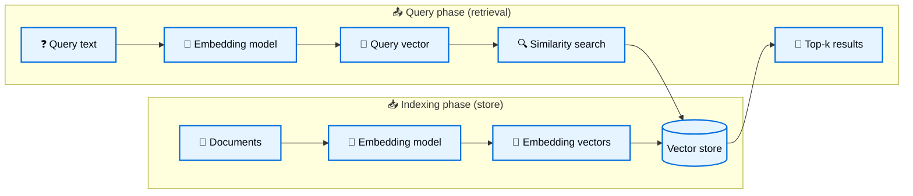

# Vector store integrations

> Integrate with vector stores using LangChain JavaScript.

## Overview

A [vector store](vectorstores.md) stores [embedded](embeddings.md) data and performs similarity search.



### Interface

LangChain provides a unified interface for vector stores, allowing you to:

* `addDocuments` - Add documents to the store.
* `delete` - Remove stored documents by ID.
* `similaritySearch` - Query for semantically similar documents.

This abstraction lets you switch between different implementations without altering your application logic.

### Initialization

Most vectorstores in LangChain accept an embedding model as an argument when initializing the vector store.

```typescript
import { OpenAIEmbeddings } from "@langchain/openai";
import { MemoryVectorStore } from "@langchain/classic/vectorstores/memory";

const embeddings = new OpenAIEmbeddings({
  model: "text-embedding-3-small",
});
const vectorStore = new MemoryVectorStore(embeddings);
```

### Adding documents

You can add documents to the vector store by using the `addDocuments` function.

```typescript
import { Document } from "@langchain/core/documents";
const document = new Document({
  pageContent: "Hello world",
});
await vectorStore.addDocuments([document]);
```

### Deleting documents

You can delete documents from the vector store by using the `delete` function.

```typescript
await vectorStore.delete({
  filter: {
    pageContent: "Hello world",
  },
});
```

### Similarity search

Issue a semantic query using `similaritySearch`, which returns the closest embedded documents:

```typescript
const results = await vectorStore.similaritySearch("Hello world", 10);
```

Many vector stores support parameters like:

* `k` — number of results to return
* `filter` — conditional filtering based on metadata

### Similarity metrics & indexing

Embedding similarity may be computed using:

* **Cosine similarity**
* **Euclidean distance**
* **Dot product**

Efficient search often employs indexing methods such as HNSW (Hierarchical Navigable Small World), though specifics depend on the vector store.

### Metadata filtering

Filtering by metadata (e.g., source, date) can refine search results:

```typescript
vectorStore.similaritySearch("query", 2, { source: "tweets" });
```

> [!IMPORTANT]
>   Support for metadata-based filtering varies between implementations.
>   Check the documentation of your chosen vector store for details.

## Top integrations

**Select embedding model:**

<details>
<summary>OpenAI</summary>

Install dependencies:

**npm**

```bash
npm install @langchain/openai @langchain/core
```

**yarn**

```bash
yarn add @langchain/openai @langchain/core
```

**pnpm**

```bash
pnpm add @langchain/openai @langchain/core
```

Add environment variables:

```bash
OPENAI_API_KEY=your-api-key
```

Instantiate the model:

```typescript
import { OpenAIEmbeddings } from "@langchain/openai";

const embeddings = new OpenAIEmbeddings({
  model: "text-embedding-3-large"
});
```

</details>

<details>
<summary>Azure</summary>

Install dependencies

**npm**

```bash
npm install @langchain/openai @langchain/core
```

**yarn**

```bash
yarn add @langchain/openai @langchain/core
```

**pnpm**

```bash
pnpm add @langchain/openai @langchain/core
```

Add environment variables:

```bash
AZURE_OPENAI_API_INSTANCE_NAME=<YOUR_INSTANCE_NAME>
AZURE_OPENAI_API_KEY=<YOUR_KEY>
AZURE_OPENAI_API_VERSION="2024-02-01"
```

Instantiate the model:

```typescript
import { AzureOpenAIEmbeddings } from "@langchain/openai";

const embeddings = new AzureOpenAIEmbeddings({
  azureOpenAIApiEmbeddingsDeploymentName: "text-embedding-ada-002"
});
```

</details>

<details>
<summary>AWS</summary>

Install dependencies:

**npm**

```bash
npm i @langchain/aws
```

**yarn**

```bash
yarn add @langchain/aws
```

**pnpm**

```bash
pnpm add @langchain/aws
```

Add environment variables:

```bash
BEDROCK_AWS_REGION=your-region
```

Instantiate the model:

```typescript
import { BedrockEmbeddings } from "@langchain/aws";

const embeddings = new BedrockEmbeddings({
  model: "amazon.titan-embed-text-v1"
});
```

</details>

<details>
<summary>Google Gemini</summary>

Install dependencies:

**npm**

```bash
npm i @langchain/google-genai
```

**yarn**

```bash
yarn add @langchain/google-genai
```

**pnpm**

```bash
pnpm add @langchain/google-genai
```

Add environment variables:

```bash
GOOGLE_API_KEY=your-api-key
```

Instantiate the model:

```typescript
import { GoogleGenerativeAIEmbeddings } from "@langchain/google-genai";

const embeddings = new GoogleGenerativeAIEmbeddings({
  model: "text-embedding-004"
});
```

</details>

<details>
<summary>Gemini Enterprise Agent Platform</summary>

Install dependencies:

**npm**

```bash
npm i @langchain/google-vertexai
```

**yarn**

```bash
yarn add @langchain/google-vertexai
```

**pnpm**

```bash
pnpm add @langchain/google-vertexai
```

Add environment variables:

```bash
GOOGLE_APPLICATION_CREDENTIALS=credentials.json
```

Instantiate the model:

```typescript
import { VertexAIEmbeddings } from "@langchain/google-vertexai";

const embeddings = new VertexAIEmbeddings({
  model: "gemini-embedding-001"
});
```

</details>

<details>
<summary>MistralAI</summary>

Install dependencies:

**npm**

```bash
npm install @langchain/mistralai @langchain/core
```

**yarn**

```bash
yarn add @langchain/mistralai @langchain/core
```

**pnpm**

```bash
pnpm add @langchain/mistralai @langchain/core
```

Add environment variables:

```bash
MISTRAL_API_KEY=your-api-key
```

Instantiate the model:

```typescript
import { MistralAIEmbeddings } from "@langchain/mistralai";

const embeddings = new MistralAIEmbeddings({
  model: "mistral-embed"
});
```

</details>

<details>
<summary>Cohere</summary>

Install dependencies:

**npm**

```bash
npm i @langchain/cohere
```

**yarn**

```bash
yarn add @langchain/cohere
```

**pnpm**

```bash
pnpm add @langchain/cohere
```

Add environment variables:

```bash
COHERE_API_KEY=your-api-key
```

Instantiate the model:

```typescript
import { CohereEmbeddings } from "@langchain/cohere";

const embeddings = new CohereEmbeddings({
  model: "embed-english-v3.0"
});
```

</details>

<details>
<summary>Ollama</summary>

Install dependencies:

**npm**

```bash
npm install @langchain/ollama @langchain/core
```

**yarn**

```bash
yarn add @langchain/ollama @langchain/core
```

**pnpm**

```bash
pnpm add @langchain/ollama @langchain/core
```

Instantiate the model:

```typescript
import { OllamaEmbeddings } from "@langchain/ollama";

const embeddings = new OllamaEmbeddings({
  model: "llama2",
  baseUrl: "http://localhost:11434", // Default value
});
```

</details>

<details>
<summary>Voyage AI</summary>

Install dependencies:

**npm**

```bash
npm install @langchain/mongodb @langchain/core
```

**yarn**

```bash
yarn add @langchain/mongodb @langchain/core
```

**pnpm**

```bash
pnpm add @langchain/mongodb @langchain/core
```

Add environment variables:

```bash
VOYAGE_API_KEY=your-api-key
```

Instantiate the model:

```typescript
import { VoyageEmbeddings } from "@langchain/mongodb";

const embeddings = new VoyageEmbeddings({
  model: "voyage-4"
});
```

</details>

**Select vector store:**

<details>
<summary>Memory</summary>

```bash
npm i langchain
```

**yarn**

```bash
yarn add langchain
```

**pnpm**

```bash
pnpm add langchain
```

```typescript
import { MemoryVectorStore } from "@langchain/classic/vectorstores/memory";

const vectorStore = new MemoryVectorStore(embeddings);
```

</details>

<details>
<summary>MongoDB</summary>

#### Manual embedding
**npm**

```bash
npm install @langchain/mongodb mongodb @langchain/core
```

**yarn**

```bash
yarn add @langchain/mongodb mongodb @langchain/core
```

**pnpm**

```bash
pnpm add @langchain/mongodb mongodb @langchain/core
```

```typescript
import { MongoDBAtlasVectorSearch } from "@langchain/mongodb"
import { MongoClient } from "mongodb";

const client = new MongoClient(process.env.MONGODB_ATLAS_URI!);
const collection = client
  .db(process.env.MONGODB_ATLAS_DB_NAME)
  .collection(process.env.MONGODB_ATLAS_COLLECTION_NAME);

const vectorStore = new MongoDBAtlasVectorSearch(embeddings, {
  collection,
  indexName: "vector_index",
  textKey: "text",
  embeddingKey: "embedding",
});
```

#### Automated embedding
**npm**

```bash
npm install @langchain/mongodb mongodb @langchain/core
```

**yarn**

```bash
yarn add @langchain/mongodb mongodb @langchain/core
```

**pnpm**

```bash
pnpm add @langchain/mongodb mongodb @langchain/core
```

```typescript
import { MongoDBAtlasVectorSearch } from "@langchain/mongodb"
import { MongoClient } from "mongodb";

const client = new MongoClient(process.env.MONGODB_ATLAS_URI!);
const collection = client
  .db(process.env.MONGODB_ATLAS_DB_NAME)
  .collection(process.env.MONGODB_ATLAS_COLLECTION_NAME);

const vectorStore = new MongoDBAtlasVectorSearch({ collection });
```

</details>

<details>
<summary>Pinecone</summary>

**npm**

```bash
npm install @langchain/pinecone @langchain/core @pinecone-database/pinecone
```

**yarn**

```bash
yarn add @langchain/pinecone @langchain/core @pinecone-database/pinecone
```

**pnpm**

```bash
pnpm add @langchain/pinecone @langchain/core @pinecone-database/pinecone
```

```typescript
import { PineconeStore } from "@langchain/pinecone";
import { Pinecone as PineconeClient } from "@pinecone-database/pinecone";

const pinecone = new PineconeClient();
const vectorStore = new PineconeStore(embeddings, {
  pineconeIndex,
  maxConcurrency: 5,
});
```

</details>

<details>
<summary>Redis</summary>

**npm**

```bash
npm install @langchain/redis @langchain/core redis
```

**yarn**

```bash
yarn add @langchain/redis @langchain/core redis
```

**pnpm**

```bash
pnpm add @langchain/redis @langchain/core redis
```

```typescript
import { RedisVectorStore } from "@langchain/redis";

const vectorStore = new RedisVectorStore(embeddings, {
  redisClient: client,
  indexName: "langchainjs-testing",
});
```

</details>

<details>
<summary>Qdrant</summary>

**npm**

```bash
npm install @langchain/qdrant @langchain/core
```

**yarn**

```bash
yarn add @langchain/qdrant @langchain/core
```

**pnpm**

```bash
pnpm add @langchain/qdrant @langchain/core
```

```typescript
import { QdrantVectorStore } from "@langchain/qdrant";

const vectorStore = await QdrantVectorStore.fromExistingCollection(embeddings, {
  url: process.env.QDRANT_URL,
  collectionName: "langchainjs-testing",
});
```

</details>

<details>
<summary>Oracle AI Database</summary>

**npm**

```bash
npm i @oracle/langchain-oracledb @langchain/core
```

**yarn**

```bash
yarn add @oracle/langchain-oracledb @langchain/core
```

**pnpm**

```bash
pnpm add @oracle/langchain-oracledb @langchain/core
```

```typescript
import oracledb from "oracledb";
import { OracleEmbeddings, OracleVS } from "@oracle/langchain-oracledb";

const connection = await oracledb.getConnection({
  user: process.env.ORACLE_USER,
  password: process.env.ORACLE_PASSWORD,
  connectionString: process.env.ORACLE_DSN,
});

const embeddings = new OracleEmbeddings(connection, {
  provider: "database",
  model: process.env.DEMO_ONNX_MODEL ?? "DEMO_MODEL",
});

const vectorStore = new OracleVS(embeddings, {
  client: connection,
  tableName: "DEMO_VECTORS",
  query: "Find support tickets mentioning service outages.",
  distanceStrategy: "DOT",
});
await vectorStore.initialize();
```

</details>

<details>
<summary>Weaviate</summary>

**npm**

```bash
npm install @langchain/weaviate @langchain/core weaviate-client
```

**yarn**

```bash
yarn add @langchain/weaviate @langchain/core weaviate-client
```

**pnpm**

```bash
pnpm add @langchain/weaviate @langchain/core weaviate-client
```

```typescript
import { WeaviateStore } from "@langchain/weaviate";

const vectorStore = new WeaviateStore(embeddings, {
    client: weaviateClient,
    indexName: "Langchainjs_test",
});
```

</details>

LangChain.js integrates with a variety of vector stores. You can check out a full list below:

## All vector stores

| Vectorstore                                                                                                          | Downloads                                                                                                                                                                                                                                                                                                          |
| :------------------------------------------------------------------------------------------------------------------- | :----------------------------------------------------------------------------------------------------------------------------------------------------------------------------------------------------------------------------------------------------------------------------------------------------------------- |
| [`WeaviateStore`](vectorstores/weaviate.md)                                                | <span data-sort-value="1102864"><a href="https://www.npmjs.com/package/@langchain/weaviate" target="_blank">  </a></span>                                   |
| [`PineconeStore`](vectorstores/pinecone.md)                                                | <span data-sort-value="656824"><a href="https://www.npmjs.com/package/@langchain/pinecone" target="_blank">  </a></span>                                    |
| [`QdrantVectorStore`](vectorstores/qdrant.md)                                              | <span data-sort-value="520848"><a href="https://www.npmjs.com/package/@langchain/qdrant" target="_blank">  </a></span>                                        |
| [`MongoDBAtlasVectorSearch`](vectorstores/mongodb_atlas.md)                                | <span data-sort-value="496248"><a href="https://www.npmjs.com/package/@langchain/mongodb" target="_blank">  </a></span>                                      |
| [`RedisVectorStore`](vectorstores/redis.md)                                                | <span data-sort-value="386818"><a href="https://www.npmjs.com/package/@langchain/redis" target="_blank">  </a></span>                                          |
| [`OracleVS`](vectorstores/oracleai.md)                                                     | <span data-sort-value="169361"><a href="https://www.npmjs.com/package/@oracle/langchain-oracledb" target="_blank">  </a></span>                      |
| [`PGVectorStore`](vectorstores/pgvector.md)                                                | <span data-sort-value="27821"><a href="https://www.npmjs.com/package/@langchain/pgvector" target="_blank">  </a></span>                                     |
| [`Cloudflare vectorize`](vectorstores/cloudflare_vectorize.md)                             | <span data-sort-value="17423"><a href="https://www.npmjs.com/package/@langchain/cloudflare" target="_blank">  </a></span>                                 |
| [`Azure Cosmos DB for MongoDB vCore (deprecated)`](vectorstores/azure_cosmosdb_mongodb.md) | <span data-sort-value="3760"><a href="https://www.npmjs.com/package/@langchain/azure-cosmosdb" target="_blank">  </a></span>                          |
| [`Azure Cosmos DB for NoSQL`](vectorstores/azure_cosmosdb_nosql.md)                        | <span data-sort-value="3760"><a href="https://www.npmjs.com/package/@langchain/azure-cosmosdb" target="_blank">  </a></span>                          |
| [`Azure DocumentDB`](vectorstores/azure_documentdb.md)                                     | <span data-sort-value="3760"><a href="https://www.npmjs.com/package/@langchain/azure-cosmosdb" target="_blank">  </a></span>                          |
| [`TurbopufferVectorStore`](vectorstores/turbopuffer.md)                                    | <span data-sort-value="2069"><a href="https://www.npmjs.com/package/@langchain/turbopuffer" target="_blank">  </a></span>                                |
| [`Neo4jVectorStore`](vectorstores/neo4jvector.md)                                          | <span data-sort-value="1014"><a href="https://www.npmjs.com/package/@langchain/neo4j" target="_blank">  </a></span>                                            |
| [`Google cloud SQL for postgresql`](vectorstores/google_cloudsql_pg.md)                    | <span data-sort-value="619"><a href="https://www.npmjs.com/package/@langchain/google-cloud-sql-pg" target="_blank">  </a></span>                 |
| [`SAP HANA Cloud Vector Engine`](vectorstores/sap_hanavector.md)                           | <span data-sort-value="571"><a href="https://www.npmjs.com/package/@sap/hana-langchain" target="_blank">  </a></span>                                       |
| [`LambdaDB`](https://docs.lambdadb.ai/guides/get-started/quickstart)                                                 | <span data-sort-value="312"><a href="https://www.npmjs.com/package/@functional-systems/langchain-lambdadb" target="_blank">  </a></span> |
| [`YDB`](vectorstores/ydb.md)                                                               | <span data-sort-value="22"><a href="https://www.npmjs.com/package/@ydbjs/langchain" target="_blank">  </a></span>                                              |
| [`Infino`](https://infino.ai/docs)                                                                                   | <span data-sort-value="18"><a href="https://www.npmjs.com/package/@infino-ai/langchain-infino" target="_blank">  </a></span>                        |
| [`langchain`](vectorstores/memory.md)                                                      | <span data-sort-value="-1">N/A</span>                                                                                                                                                                                                                                                                              |

***

> [!NOTE]
> [Connect these docs](../../use-these-docs.md) to Claude, VSCode, and more via MCP for real-time answers.

> [!NOTE]
> [Edit this page on GitHub](https://github.com/langchain-ai/docs/edit/main/src/oss/javascript/integrations/vectorstores/index.mdx) or [file an issue](https://github.com/langchain-ai/docs/issues/new/choose).
