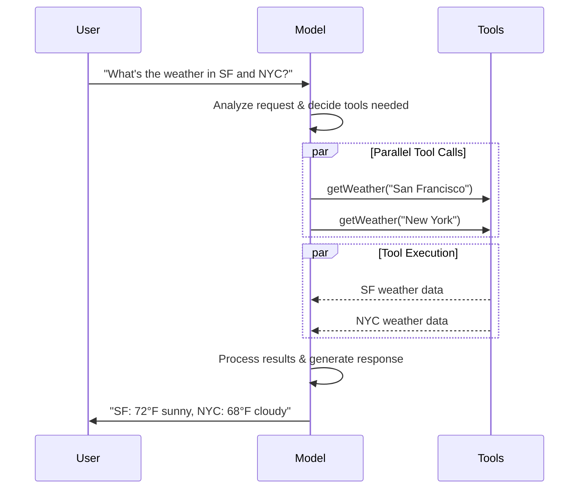

# Models

[LLMs](https://en.wikipedia.org/wiki/Large_language_model) are powerful AI tools that can interpret and generate text like humans. They're versatile enough to write content, translate languages, summarize, and answer questions without needing specialized training for each task.

In addition to text generation, many models support:

*  [Tool calling](#tool-calling) - calling external tools (like databases queries or API calls) and use results in their responses.
*  [Structured output](#structured-output) - where the model's response is constrained to follow a defined format.
*  [Multimodality](#multimodal) - process and return data other than text, such as images, audio, and video.
*  [Reasoning](#reasoning) - models perform multi-step reasoning to arrive at a conclusion.

Models are the reasoning engine of [agents](agents.md). They drive the agent's decision-making process, determining which tools to call, how to interpret results, and when to provide a final answer.

The quality and capabilities of the model you choose directly impact your agent's baseline reliability and performance. Different models excel at different tasks - some are better at following complex instructions, others at structured reasoning, and some support larger context windows for handling more information.

LangChain's standard model interfaces give you access to many different provider integrations, which makes it easy to experiment with and switch between models to find the best fit for your use case.

For provider-specific integration information and capabilities, see the provider's [chat model page](../integrations/chat.md).

> [!TIP]
> [LangSmith](../../langsmith/observability.md) traces each model call so you can compare providers, inspect tool routing, and debug failures. Follow the [tracing quickstart](../../langsmith/trace-with-langchain.md) to get set up.
>
> We recommend you also set up [LangSmith Engine](../../langsmith/engine.md) which monitors your traces, detects issues, and proposes fixes.

## Basic usage

Models can be utilized in two ways:

1. **With agents** - Models can be dynamically specified when creating an [agent](agents.md#model).
2. **Standalone** - Models can be called directly (outside of the agent loop) for tasks like text generation, classification, or extraction without the need for an agent framework.

The same model interface works in both contexts, which gives you the flexibility to start simple and scale up to more complex agent-based workflows as needed.

### Initialize a model

The easiest way to get started with a standalone model in LangChain is to use `initChatModel` to initialize one from a [chat model provider](../integrations/chat.md) of your choice (examples below):

#### OpenAI
👉 Read the [OpenAI chat model integration docs](../integrations/chat/openai.md)

**npm**

```bash
npm install @langchain/openai
```

**pnpm**

```bash
pnpm install @langchain/openai
```

**yarn**

```bash
yarn add @langchain/openai
```

**bun**

```bash
bun add @langchain/openai
```

**initChatModel**

```typescript
import { initChatModel } from "langchain";

process.env.OPENAI_API_KEY = "your-api-key";

const model = await initChatModel("gpt-5.5");
```

**Model Class**

```typescript
import { ChatOpenAI } from "@langchain/openai";

const model = new ChatOpenAI({
  model: "gpt-5.5",
  apiKey: "your-api-key"
});
```

#### Anthropic
👉 Read the [Anthropic chat model integration docs](../integrations/chat/anthropic.md)

**npm**

```bash
npm install @langchain/anthropic
```

**pnpm**

```bash
pnpm install @langchain/anthropic
```

**yarn**

```bash
yarn add @langchain/anthropic
```

**pnpm**

```bash
pnpm add @langchain/anthropic
```

**initChatModel**

```typescript
import { initChatModel } from "langchain";

process.env.ANTHROPIC_API_KEY = "your-api-key";

const model = await initChatModel("claude-sonnet-4-6");
```

**Model Class**

```typescript
import { ChatAnthropic } from "@langchain/anthropic";

const model = new ChatAnthropic({
  model: "claude-sonnet-4-6",
  apiKey: "your-api-key"
});
```

#### Azure
👉 Read the [Azure chat model integration docs](../integrations/chat/azure.md)

**npm**

```bash
npm install @langchain/azure
```

**pnpm**

```bash
pnpm install @langchain/azure
```

**yarn**

```bash
yarn add @langchain/azure
```

**bun**

```bash
bun add @langchain/azure
```

**initChatModel**

```typescript
import { initChatModel } from "langchain";

process.env.AZURE_OPENAI_API_KEY = "your-api-key";
process.env.AZURE_OPENAI_ENDPOINT = "your-endpoint";
process.env.OPENAI_API_VERSION = "your-api-version";

const model = await initChatModel("azure_openai:gpt-5.5");
```

**Model Class**

```typescript
import { AzureChatOpenAI } from "@langchain/openai";

const model = new AzureChatOpenAI({
  model: "gpt-5.5",
  azureOpenAIApiKey: "your-api-key",
  azureOpenAIApiEndpoint: "your-endpoint",
  azureOpenAIApiVersion: "your-api-version"
});
```

#### Google Gemini
👉 Read the [Google GenAI chat model integration docs](../integrations/chat/google_generative_ai.md)

**npm**

```bash
npm install @langchain/google-genai
```

**pnpm**

```bash
pnpm install @langchain/google-genai
```

**yarn**

```bash
yarn add @langchain/google-genai
```

**bun**

```bash
bun add @langchain/google-genai
```

**initChatModel**

```typescript
import { initChatModel } from "langchain";

process.env.GOOGLE_API_KEY = "your-api-key";

const model = await initChatModel("google-genai:gemini-3.7-flash");
```

**Model Class**

```typescript
import { ChatGoogleGenerativeAI } from "@langchain/google-genai";

const model = new ChatGoogleGenerativeAI({
  model: "gemini-3.7-flash",
  apiKey: "your-api-key"
});
```

#### Bedrock Converse
👉 Read the [AWS Bedrock chat model integration docs](../integrations/chat/bedrock_converse.md)

**npm**

```bash
npm install @langchain/aws
```

**pnpm**

```bash
pnpm install @langchain/aws
```

**yarn**

```bash
yarn add @langchain/aws
```

**bun**

```bash
bun add @langchain/aws
```

**initChatModel**

```typescript
import { initChatModel } from "langchain";

// Follow the steps here to configure your credentials:
// https://docs.aws.amazon.com/bedrock/latest/userguide/getting-started.html

const model = await initChatModel("bedrock:gpt-5.5");
```

**Model Class**

```typescript
import { ChatBedrockConverse } from "@langchain/aws";

// Follow the steps here to configure your credentials:
// https://docs.aws.amazon.com/bedrock/latest/userguide/getting-started.html

const model = new ChatBedrockConverse({
  model: "gpt-5.5",
  region: "us-east-2"
});
```

```typescript
const response = await model.invoke("Why do parrots talk?");
```

See [`initChatModel`](https://reference.langchain.com/javascript/langchain/chat_models/universal/initChatModel) for more detail, including information on how to pass model [parameters](#parameters).

### Supported providers and models

LangChain supports all major model providers through dedicated integration packages. Each provider package implements the same standard interface, so you can swap providers without rewriting application logic. New model names work immediately — no LangChain update required — because provider packages pass model names directly to the provider's API.

Browse the [full list of supported providers](../integrations/providers/overview.md), or see [Providers and models](../concepts/providers-and-models.md) for a conceptual overview of how providers, packages, and model names work together in LangChain.

### Key methods

#### [Invoke](#invoke)
The model takes messages as input and outputs messages after generating a complete response.

#### [Stream](#stream)
Invoke the model, but stream the output as it is generated in real-time.

#### [Batch](#batch)
Send multiple requests to a model in a batch for more efficient processing.

> [!NOTE]
> In addition to chat models, LangChain provides support for other adjacent technologies, such as embedding models and vector stores. See the [integrations page](../integrations/providers/overview.md) for details.

## Parameters

A chat model takes parameters that can be used to configure its behavior. The full set of supported parameters varies by model and provider, but standard ones include:

#### `Field` — `string`
The name or identifier of the specific model you want to use with a provider. You can also specify both the model and its provider in a single argument using the '{model_provider}:{model}' format, for example, 'openai:o1'.

#### `Field` — `string`
The key required for authenticating with the model's provider. This is usually issued when you sign up for access to the model. Often accessed by setting an environment variable.

#### `Field` — `number`
Controls the randomness of the model's output. A higher number makes responses more creative; lower ones make them more deterministic.

#### `Field` — `number`
Limits the total number of tokens in the response, effectively controlling how long the output can be.

#### `Field` — `number`
The maximum time (in seconds) to wait for a response from the model before canceling the request.

#### `Field` — `number`
The maximum number of attempts the system will make to resend a request if it fails due to issues like network timeouts or rate limits. Retries use exponential backoff with jitter. Network errors, rate limits (429), and server errors (5xx) are retried automatically. Client errors such as 401 (unauthorized) or 404 are not retried. For long-running [agent](../deepagents/overview.md) tasks on unreliable networks, consider increasing this to 10–15.

On providers that support it, [model retry middleware](middleware/built-in.md#model-retry) takes over retries for the calls it wraps, and this value does not apply to them.

Using `initChatModel`, pass these parameters as inline parameters:

**Initialize using model parameters**

```typescript
const model = await initChatModel(
    "claude-sonnet-4-6",
    { temperature: 0.7, timeout: 30, maxTokens: 1000, maxRetries: 6 }
)
```

### Connection resilience

LangChain chat models automatically retry failed API requests with exponential backoff. By default, models retry up to **6 times** for network errors, rate limits (429), and server errors (5xx). Client errors like 401 (unauthorized) or 404 are not retried.

You can adjust `maxRetries` and `timeout` when creating a model, then pass that instance to `createAgent`, `createDeepAgent`, or call it standalone:

```typescript
import { ChatAnthropic } from "@langchain/anthropic";

const model = new ChatAnthropic({
  model: "google_genai:gemini-3.6-flash",
  maxRetries: 10, // Increase for unreliable networks (default: 6)
  timeout: 120_000, // Milliseconds; increase for slow connections
});
```

> [!TIP]
> For long-running agent graphs on unreliable networks, consider higher `max_retries` (for example 10–15) and a [checkpointer](../langgraph/persistence.md) so that progress is preserved across failures.

> [!NOTE]
> Each chat model integration may have additional params used to control provider-specific functionality.
>
> For example, [`ChatOpenAI`](https://reference.langchain.com/javascript/langchain-openai/ChatOpenAI) has `use_responses_api` to dictate whether to use the OpenAI Responses or Completions API.
>
> To find all the parameters supported by a given chat model, head to the [chat model integrations](../integrations/chat.md) page.

***

## Invocation

A chat model must be invoked to generate an output. There are three primary invocation methods, each suited to different use cases.

### Invoke

The most straightforward way to call a model is to use [`invoke()`](https://reference.langchain.com/javascript/classes/_langchain_core.language_models_chat_models.BaseChatModel.html#invoke) with a single message or a list of messages.

**Single message**

```typescript
const response = await model.invoke("Why do parrots have colorful feathers?");
console.log(response);
```

A list of messages can be provided to a chat model to represent conversation history. Each message has a role that models use to indicate who sent the message in the conversation.

See the [messages](messages.md) guide for more detail on roles, types, and content.

**Object format**

```typescript
const conversation = [
  { role: "system", content: "You are a helpful assistant that translates English to French." },
  { role: "user", content: "Translate: I love programming." },
  { role: "assistant", content: "J'adore la programmation." },
  { role: "user", content: "Translate: I love building applications." },
];

const response = await model.invoke(conversation);
console.log(response);  // AIMessage("J'adore créer des applications.")
```

**Message objects**

```typescript
import { HumanMessage, AIMessage, SystemMessage } from "langchain";

const conversation = [
  new SystemMessage("You are a helpful assistant that translates English to French."),
  new HumanMessage("Translate: I love programming."),
  new AIMessage("J'adore la programmation."),
  new HumanMessage("Translate: I love building applications."),
];

const response = await model.invoke(conversation);
console.log(response);  // AIMessage("J'adore créer des applications.")
```

> [!NOTE]
> If the return type of your invocation is a string, ensure that you are using a chat model as opposed to an LLM. Legacy, text-completion LLMs return strings directly. LangChain chat models are prefixed with "Chat", e.g., [`ChatOpenAI`](https://reference.langchain.com/javascript/langchain-openai/ChatOpenAI)(/oss/integrations/chat/openai).

### Stream

Most models can stream their output content while it is being generated. By displaying output progressively, streaming significantly improves user experience, particularly for longer responses.

Calling [`stream()`](https://reference.langchain.com/javascript/classes/_langchain_core.language_models_chat_models.BaseChatModel.html#stream) returns an iterator that yields output chunks as they are produced. You can use a loop to process each chunk in real-time:

**Basic text streaming**

```typescript
const stream = await model.stream("Why do parrots have colorful feathers?");
for await (const chunk of stream) {
  console.log(chunk.text)
}
```

**Stream tool calls, reasoning, and other content**

```typescript
const stream = await model.stream("What color is the sky?");
for await (const chunk of stream) {
  for (const block of chunk.contentBlocks) {
    if (block.type === "reasoning") {
      console.log(`Reasoning: ${block.reasoning}`);
    } else if (block.type === "tool_call_chunk") {
      console.log(`Tool call chunk: ${block}`);
    } else if (block.type === "text") {
      console.log(block.text);
    } else {
      ...
    }
  }
}
```

As opposed to [`invoke()`](#invoke), which returns a single [`AIMessage`](https://reference.langchain.com/javascript/langchain-core/messages/AIMessage) after the model has finished generating its full response, `stream()` returns multiple [`AIMessageChunk`](https://reference.langchain.com/javascript/langchain-core/messages/AIMessageChunk) objects, each containing a portion of the output text. Importantly, each chunk in a stream is designed to be gathered into a full message via summation:

**Construct AIMessage**

```typescript
let full: AIMessageChunk | null = null;
for await (const chunk of stream) {
  full = full ? full.concat(chunk) : chunk;
  console.log(full.text);
}

// The
// The sky
// The sky is
// The sky is typically
// The sky is typically blue
// ...

console.log(full.contentBlocks);
// [{"type": "text", "text": "The sky is typically blue..."}]
```

The resulting message can be treated the same as a message that was generated with [`invoke()`](#invoke)—for example, it can be aggregated into a message history and passed back to the model as conversational context.

> [!WARNING]
> Streaming only works if all steps in the program know how to process a stream of chunks. For instance, an application that isn't streaming-capable would be one that needs to store the entire output in memory before it can be processed.

<details>
<summary>Advanced streaming topics</summary>

<details>
<summary>Streaming events</summary>

LangChain chat models can also stream semantic events using
\[`streamEvents()`]\[BaseChatModel.streamEvents].

This simplifies filtering based on event types and other metadata, and will aggregate the full message in the background. See below for an example.

```typescript
const stream = await model.streamEvents("Hello");
for await (const event of stream) {
    if (event.event === "on_chat_model_start") {
        console.log(`Input: ${event.data.input}`);
    }
    if (event.event === "on_chat_model_stream") {
        console.log(`Token: ${event.data.chunk.text}`);
    }
    if (event.event === "on_chat_model_end") {
        console.log(`Full message: ${event.data.output.text}`);
    }
}
```

```txt
Input: Hello
Token: Hi
Token:  there
Token: !
Token:  How
Token:  can
Token:  I
...
Full message: Hi there! How can I help today?
```

See the [`streamEvents()`](https://reference.langchain.com/javascript/classes/_langchain_core.language_models_chat_models.BaseChatModel.html#streamEvents) reference for event types and other details.

</details>

<details>
<summary>&#x22;Auto-streaming&#x22; chat models</summary>

LangChain simplifies streaming from chat models by automatically enabling streaming mode in certain cases, even when you're not explicitly calling the streaming methods. This is particularly useful when you use the non-streaming invoke method but still want to stream the entire application, including intermediate results from the chat model.

In [LangGraph agents](agents.md), for example, you can call `model.invoke()` within nodes, but LangChain will automatically delegate to streaming if running in a streaming mode.

#### How it works

When you `invoke()` a chat model, LangChain will automatically switch to an internal streaming mode if it detects that you are trying to stream the overall application. The result of the invocation will be the same as far as the code that was using invoke is concerned; however, while the chat model is being streamed, LangChain will take care of invoking [`on_llm_new_token`](https://reference.langchain.com/javascript/interfaces/_langchain_core.callbacks_base.BaseCallbackHandlerMethods.html#onLlmNewToken) events in LangChain's callback system.

Callback events allow LangGraph `stream()` and `streamEvents()` to surface the chat model's output in real-time.

</details>

</details>

### Batch

Batching a collection of independent requests to a model can significantly improve performance and reduce costs, as the processing can be done in parallel:

**Batch**

```typescript
const responses = await model.batch([
  "Why do parrots have colorful feathers?",
  "How do airplanes fly?",
  "What is quantum computing?",
  "Why do parrots have colorful feathers?",
  "How do airplanes fly?",
  "What is quantum computing?",
]);
for (const response of responses) {
  console.log(response);
}
```

> [!TIP]
> When processing a large number of inputs using `batch()`, you may want to control the maximum number of parallel calls. This can be done by setting the `maxConcurrency` attribute in the [`RunnableConfig`](https://reference.langchain.com/javascript/langchain-core/runnables/RunnableConfig) dictionary.
>
> **Batch with max concurrency**
>
> ```typescript
> model.batch(
>   listOfInputs,
>   {
>     maxConcurrency: 5,  // Limit to 5 parallel calls
>   }
> )
> ```
>
> See the [`RunnableConfig`](https://reference.langchain.com/javascript/langchain-core/runnables/RunnableConfig) reference for a full list of supported attributes.

For more details on batching, see the [reference](https://reference.langchain.com/javascript/classes/_langchain_core.language_models_chat_models.BaseChatModel.html#batch).

***

## Tool calling

Models can request to call tools that perform tasks such as fetching data from a database, searching the web, or running code. Tools are pairings of:

1. A schema, including the name of the tool, a description, and/or argument definitions (often a JSON schema)
2. A function or coroutine to execute.

> [!NOTE]
> You may hear the term "function calling". We use this interchangeably with "tool calling".

Here's the basic tool calling flow between a user and a model:



To make tools that you have defined available for use by a model, you must bind them using [`bindTools`](https://reference.langchain.com/javascript/classes/_langchain_core.language_models_chat_models.BaseChatModel.html#bindTools). In subsequent invocations, the model can choose to call any of the bound tools as needed.

Some model providers offer built-in tools that can be enabled via model or invocation parameters (e.g. [`ChatOpenAI`](../integrations/chat/openai.md), [`ChatAnthropic`](../integrations/chat/anthropic.md)). Check the respective [provider reference](../integrations/providers/overview.md) for details.

> [!TIP]
> See the [tools guide](tools.md) for details and other options for creating tools.

**Binding user tools**

```typescript
import { tool } from "langchain";
import * as z from "zod";
import { ChatOpenAI } from "@langchain/openai";

const getWeather = tool(
  (input) => `It's sunny in ${input.location}.`,
  {
    name: "get_weather",
    description: "Get the weather at a location.",
    schema: z.object({
      location: z.string().describe("The location to get the weather for"),
    }),
  },
);

const model = new ChatOpenAI({ model: "gpt-5.5" });
const modelWithTools = model.bindTools([getWeather]);  // [!code highlight]

const response = await modelWithTools.invoke("What's the weather like in Boston?");
const toolCalls = response.tool_calls || [];
for (const tool_call of toolCalls) {
  // View tool calls made by the model
  console.log(`Tool: ${tool_call.name}`);
  console.log(`Args: ${tool_call.args}`);
}
```

When binding user-defined tools, the model's response includes a **request** to execute a tool. When using a model separately from an [agent](agents.md), it is up to you to execute the requested tool and return the result back to the model for use in subsequent reasoning. When using an [agent](agents.md), the agent loop will handle the tool execution loop for you.

Below, we show some common ways you can use tool calling.

<details>
<summary>Tool execution loop</summary>

When a model returns tool calls, you need to execute the tools and pass the results back to the model. This creates a conversation loop where the model can use tool results to generate its final response. LangChain includes [agent](agents.md) abstractions that handle this orchestration for you.

Here's a simple example of how to do this:

**Tool execution loop**

```typescript
// Bind (potentially multiple) tools to the model
const modelWithTools = model.bindTools([get_weather])

// Step 1: Model generates tool calls
const messages = [{"role": "user", "content": "What's the weather in Boston?"}]
const ai_msg = await modelWithTools.invoke(messages)
messages.push(ai_msg)

// Step 2: Execute tools and collect results
for (const tool_call of ai_msg.tool_calls) {
    // Execute the tool with the generated arguments
    const tool_result = await get_weather.invoke(tool_call)
    messages.push(tool_result)
}

// Step 3: Pass results back to model for final response
const final_response = await modelWithTools.invoke(messages)
console.log(final_response.text)
// "The current weather in Boston is 72°F and sunny."
```

Each [`ToolMessage`](https://reference.langchain.com/javascript/langchain-core/messages/ToolMessage) returned by the tool includes a `tool_call_id` that matches the original tool call, helping the model correlate results with requests.

</details>

<details>
<summary>Forcing tool calls</summary>

By default, the model has the freedom to choose which bound tool to use based on the user's input. However, you might want to force choosing a tool, ensuring the model uses either a particular tool or **any** tool from a given list:

**Force use of any tool**

```typescript
const modelWithTools = model.bindTools([tool_1], { toolChoice: "any" })
```

**Force use of specific tools**

```typescript
const modelWithTools = model.bindTools([tool_1], { toolChoice: "tool_1" })
```

</details>

<details>
<summary>Parallel tool calls</summary>

Many models support calling multiple tools in parallel when appropriate. This allows the model to gather information from different sources simultaneously.

**Parallel tool calls**

```typescript
const modelWithTools = model.bind_tools([get_weather])

const response = await modelWithTools.invoke(
    "What's the weather in Boston and Tokyo?"
)

// The model may generate multiple tool calls
console.log(response.tool_calls)
// [
//   { name: 'get_weather', args: { location: 'Boston' }, id: 'call_1' },
//   { name: 'get_weather', args: { location: 'Tokyo' }, id: 'call_2' }
// ]

// Execute all tools (can be done in parallel with async)
const results = []
for (const tool_call of response.tool_calls || []) {
    if (tool_call.name === 'get_weather') {
        const result = await get_weather.invoke(tool_call)
        results.push(result)
    }
}
```

The model intelligently determines when parallel execution is appropriate based on the independence of the requested operations.

> [!TIP]
> Most models supporting tool calling enable parallel tool calls by default. Some (including [OpenAI](../integrations/chat/openai.md) and [Anthropic](../integrations/chat/anthropic.md)) allow you to disable this feature. To do this, set `parallel_tool_calls=False`:
>
> ```python
> model.bind_tools([get_weather], parallel_tool_calls=False)
> ```

</details>

<details>
<summary>Streaming tool calls</summary>

When streaming responses, tool calls are progressively built through [`ToolCallChunk`](https://reference.langchain.com/javascript/langchain-core/messages/ContentBlock/Tools/ToolCallChunk). This allows you to see tool calls as they're being generated rather than waiting for the complete response.

**Streaming tool calls**

```typescript
const stream = await modelWithTools.stream(
    "What's the weather in Boston and Tokyo?"
)
for await (const chunk of stream) {
    // Tool call chunks arrive progressively
    if (chunk.tool_call_chunks) {
        for (const tool_chunk of chunk.tool_call_chunks) {
        console.log(`Tool: ${tool_chunk.get('name', '')}`)
        console.log(`Args: ${tool_chunk.get('args', '')}`)
        }
    }
}

// Output:
// Tool: get_weather
// Args:
// Tool:
// Args: {"loc
// Tool:
// Args: ation": "BOS"}
// Tool: get_time
// Args:
// Tool:
// Args: {"timezone": "Tokyo"}
```

You can accumulate chunks to build complete tool calls:

**Accumulate tool calls**

```typescript
let full: AIMessageChunk | null = null
const stream = await modelWithTools.stream("What's the weather in Boston?")
for await (const chunk of stream) {
    full = full ? full.concat(chunk) : chunk
    console.log(full.contentBlocks)
}
```

</details>

***

## Structured output

Models can be requested to provide their response in a format matching a given schema. This is useful for ensuring the output can be easily parsed and used in subsequent processing. LangChain supports multiple schema types and methods for enforcing structured output.

> [!TIP]
> To learn about structured output, see [Structured output](structured-output.md).

#### Zod
A [zod schema](https://zod.dev/) is the preferred method of defining an output schema. Note that when a zod schema is provided, the model output will also be validated against the schema using zod's parse methods.

```typescript
import * as z from "zod";

const Movie = z.object({
  title: z.string().describe("The title of the movie"),
  year: z.number().describe("The year the movie was released"),
  director: z.string().describe("The director of the movie"),
  rating: z.number().describe("The movie's rating out of 10"),
});

const modelWithStructure = model.withStructuredOutput(Movie);

const response = await modelWithStructure.invoke("Provide details about the movie Inception");
console.log(response);
// {
//   title: "Inception",
//   year: 2010,
//   director: "Christopher Nolan",
//   rating: 8.8,
// }
```

#### JSON Schema
For maximum control or interoperability, you can provide a raw JSON Schema.

```typescript
const jsonSchema = {
  "title": "Movie",
  "description": "A movie with details",
  "type": "object",
  "properties": {
    "title": {
      "type": "string",
      "description": "The title of the movie",
    },
    "year": {
      "type": "integer",
      "description": "The year the movie was released",
    },
    "director": {
      "type": "string",
      "description": "The director of the movie",
    },
    "rating": {
      "type": "number",
      "description": "The movie's rating out of 10",
    },
  },
  "required": ["title", "year", "director", "rating"],
}

const modelWithStructure = model.withStructuredOutput(
  jsonSchema,
  { method: "jsonSchema" },
)

const response = await modelWithStructure.invoke("Provide details about the movie Inception")
console.log(response)  // {'title': 'Inception', 'year': 2010, ...}
```

#### Standard Schema
Any schema from a library implementing the [Standard Schema](https://standardschema.dev/) specification is also supported. Standard Schema objects are validated at runtime via the schema's `~standard.validate()` method.

```typescript
import * as v from "valibot";
import { toStandardJsonSchema } from "@valibot/to-json-schema";

const Movie = toStandardJsonSchema(
  v.object({
    title: v.pipe(v.string(), v.description("The title of the movie")),
    year: v.pipe(v.number(), v.description("The year the movie was released")),
    director: v.pipe(v.string(), v.description("The director of the movie")),
    rating: v.pipe(v.number(), v.description("The movie's rating out of 10")),
  })
);

const modelWithStructure = model.withStructuredOutput(Movie);

const response = await modelWithStructure.invoke("Provide details about the movie Inception");
console.log(response);
// {
//   title: "Inception",
//   year: 2010,
//   director: "Christopher Nolan",
//   rating: 8.8,
// }
```

> [!NOTE]
> **Key considerations for structured output:**
>
> * **Method parameter**: Some providers support different methods (`'jsonSchema'`, `'functionCalling'`, `'jsonMode'`)
> * **Include raw**: Use [`includeRaw: true`](https://reference.langchain.com/javascript/classes/_langchain_core.language_models_chat_models.BaseChatModel.html#withStructuredOutput) to get both the parsed output and the raw [`AIMessage`](https://reference.langchain.com/javascript/langchain-core/messages/AIMessage)
> * **Validation**: Zod and Standard Schema objects provide automatic validation, while JSON Schema requires manual validation
> * **Standard Schema**: Any schema library implementing the [Standard Schema](https://standardschema.dev/) spec is supported and validated at runtime
>
> See your [provider's integration page](../integrations/providers/overview.md) for supported methods and configuration options.

<details>
<summary>Example: Message output alongside parsed structure</summary>

It can be useful to return the raw [`AIMessage`](https://reference.langchain.com/javascript/langchain-core/messages/AIMessage) object alongside the parsed representation to access response metadata such as [token counts](#token-usage). To do this, set [`include_raw=True`](https://reference.langchain.com/javascript/classes/_langchain_core.language_models_chat_models.BaseChatModel.html#withStructuredOutput) when calling [`with_structured_output`](https://reference.langchain.com/javascript/classes/_langchain_core.language_models_chat_models.BaseChatModel.html#withStructuredOutput):

```typescript
import * as z from "zod";

const Movie = z.object({
  title: z.string().describe("The title of the movie"),
  year: z.number().describe("The year the movie was released"),
  director: z.string().describe("The director of the movie"),
  rating: z.number().describe("The movie's rating out of 10"),
  title: z.string().describe("The title of the movie"),
  year: z.number().describe("The year the movie was released"),
  director: z.string().describe("The director of the movie"),  // [!code highlight]
  rating: z.number().describe("The movie's rating out of 10"),
});

const modelWithStructure = model.withStructuredOutput(Movie, { includeRaw: true });

const response = await modelWithStructure.invoke("Provide details about the movie Inception");
console.log(response);
// {
//   raw: AIMessage { ... },
//   parsed: { title: "Inception", ... }
// }
```

</details>

<details>
<summary>Example: Nested structures</summary>

Schemas can be nested:

```typescript
import * as z from "zod";

const Actor = z.object({
  name: z.string(),
  role: z.string(),
});

const MovieDetails = z.object({
  title: z.string(),
  year: z.number(),
  cast: z.array(Actor),
  genres: z.array(z.string()),
  budget: z.number().nullable().describe("Budget in millions USD"),
});

const modelWithStructure = model.withStructuredOutput(MovieDetails);
```

</details>

***

## Advanced topics

### Model profiles

> [!NOTE]
> Model profiles require `langchain>=1.1`.

LangChain chat models can expose a dictionary of supported features and capabilities through a `profile` property:

```typescript
model.profile;
// {
//   maxInputTokens: 400000,
//   imageInputs: true,
//   reasoningOutput: true,
//   toolCalling: true,
//   ...
// }
```

Refer to the full set of fields in the [API reference](https://reference.langchain.com/javascript/langchain-core/language_models/profile/ModelProfile).

Much of the model profile data is powered by the [models.dev](https://github.com/sst/models.dev) project, an open source initiative that provides model capability data. This data is augmented with additional fields for purposes of use with LangChain. These augmentations are kept aligned with the upstream project as it evolves.

Model profile data allow applications to work around model capabilities dynamically. For example:

1. [Summarization middleware](middleware/built-in.md#summarization) can trigger summarization based on a model's context window size.
2. [Structured output](structured-output.md) strategies in `createAgent` can be inferred automatically (e.g., by checking support for native structured output features).
3. Model inputs can be gated based on supported [modalities](#multimodal) and maximum input tokens.
4. [Deep Agents Code](../../deepagents/code.md) filters the [interactive model switcher](../../deepagents/code/providers.md#which-models-appear-in-the-switcher) to models whose profiles report `tool_calling` support and text I/O, and displays context window sizes and capability flags in the selector detail view.

<details>
<summary>Modify profile data</summary>

Model profile data can be changed if it is missing, stale, or incorrect.

**Option 1 (quick fix)**

You can instantiate a chat model with any valid profile:

```typescript
const customProfile = {
maxInputTokens: 100_000,
toolCalling: true,
structuredOutput: true,
// ...
};
const model = initChatModel("...", { profile: customProfile });
```

**Option 2 (fix data upstream)**

The primary source for the data is the [models.dev](https://models.dev/) project. These data are merged with additional fields and overrides in LangChain [integration packages](../integrations/providers/overview.md) and are shipped with those packages.

Model profile data can be updated through the following process:

1. (If needed) update the source data at [models.dev](https://models.dev/) through a pull request to its [repository on GitHub](https://github.com/sst/models.dev).
2. (If needed) update additional fields and overrides in `langchain-<package>/profiles.toml` through a pull request to the LangChain [integration package](../integrations/providers/overview.md).

</details>

> [!WARNING]
> Model profiles are a beta feature. The format of a profile is subject to change.

### Multimodal

Certain models can process and return non-textual data such as images, audio, and video. You can pass non-textual data to a model by providing [content blocks](messages.md#message-content).

> [!TIP]
> All LangChain chat models with underlying multimodal capabilities support:
>
> 1. Data in the cross-provider standard format (see [our messages guide](messages.md))
> 2. OpenAI [chat completions](https://platform.openai.com/docs/api-reference/chat) format
> 3. Any format that is native to that specific provider (e.g., Anthropic models accept Anthropic native format)

See the [multimodal section](messages.md#multimodal) of the messages guide for details.

Some models can return multimodal data as part of their response. If invoked to do so, the resulting [`AIMessage`](https://reference.langchain.com/javascript/langchain-core/messages/AIMessage) will have content blocks with multimodal types.

**Multimodal output**

```typescript
const response = await model.invoke("Create a picture of a cat");
console.log(response.contentBlocks);
// [
//   { type: "text", text: "Here's a picture of a cat" },
//   { type: "image", data: "...", mimeType: "image/jpeg" },
// ]
```

See the [integrations page](../integrations/providers/overview.md) for details on specific providers.

### Reasoning

Many models are capable of performing multi-step reasoning to arrive at a conclusion. This involves breaking down complex problems into smaller, more manageable steps.

**If supported by the underlying model,** you can surface this reasoning process to better understand how the model arrived at its final answer.

**Stream reasoning output**

```typescript
const stream = model.stream("Why do parrots have colorful feathers?");
for await (const chunk of stream) {
    const reasoningSteps = chunk.contentBlocks.filter(b => b.type === "reasoning");
    console.log(reasoningSteps.length > 0 ? reasoningSteps : chunk.text);
}
```

**Complete reasoning output**

```typescript
const response = await model.invoke("Why do parrots have colorful feathers?");
const reasoningSteps = response.contentBlocks.filter(b => b.type === "reasoning");
console.log(reasoningSteps.map(step => step.reasoning).join(" "));
```

Depending on the model, you can sometimes specify the level of effort it should put into reasoning. Similarly, you can request that the model turn off reasoning entirely. This may take the form of categorical "tiers" of reasoning (e.g., `'low'` or `'high'`) or integer token budgets.

For details, see the [integrations page](../integrations/providers/overview.md) or [reference](https://reference.langchain.com/python/integrations/) for your respective chat model.

### Local models

LangChain supports running models locally on your own hardware. This is useful for scenarios where either data privacy is critical, you want to invoke a custom model, or when you want to avoid the costs incurred when using a cloud-based model.

[Ollama](../integrations/chat/ollama.md) is one of the easiest ways to run chat and embedding models locally.

### Prompt caching

Many providers offer prompt caching features to reduce latency and cost on repeat processing of the same tokens. You can engage caching at three levels:

* **Implicit provider caching:** providers automatically pass on cost savings if a request hits a cache, with no configuration required. Examples: [OpenAI](../integrations/chat/openai.md) and [Gemini](../integrations/chat/google_generative_ai.md).
* **Provider-level explicit controls:** providers let you manually indicate cache points for greater control or to guarantee cost savings. These mirror the underlying provider/API behavior. Examples:
  * [`ChatOpenAI`](https://reference.langchain.com/javascript/langchain-openai/ChatOpenAI) (via `prompt_cache_key`)
  * Anthropic content-block [`cache_control`](../integrations/chat/anthropic.md#prompt-caching)
  * [Gemini](https://reference.langchain.com/python/integrations/langchain_google_genai/).

> [!WARNING]
> Prompt caching is often only engaged above a minimum input token threshold. See [provider pages](../integrations/chat.md) for details.

Cache usage will be reflected in the [usage metadata](messages.md#token-usage) of the model response.

### Server-side tool use

Some providers support server-side [tool-calling](#tool-calling) loops: models can interact with web search, code interpreters, and other tools and analyze the results in a single conversational turn.

If a model invokes a tool server-side, the content of the response message will include content representing the invocation and result of the tool. Accessing the [content blocks](messages.md#standard-content-blocks) of the response will return the server-side tool calls and results in a provider-agnostic format:

```typescript
import { initChatModel } from "langchain";

const model = await initChatModel("gpt-5.4-mini");
const modelWithTools = model.bindTools([{ type: "web_search" }])

const message = await modelWithTools.invoke("What was a positive news story from today?");
console.log(message.contentBlocks);
```

This represents a single conversational turn; there are no associated [ToolMessage](messages.md#tool-message) objects that need to be passed in as in client-side [tool-calling](#tool-calling).

See the [integration page](../integrations/chat.md) for your given provider for available tools and usage details.

### Base URL and proxy settings

You can configure a custom base URL for providers that implement the OpenAI Chat Completions API.

> [!WARNING]
> `model_provider="openai"` (or direct `ChatOpenAI` usage) targets the official OpenAI API specification. Provider-specific fields from routers and proxies may not be extracted or preserved.
>
> For OpenRouter and LiteLLM, prefer the dedicated integrations:
>
> * [OpenRouter via `ChatOpenRouter`](../integrations/chat/openrouter.md) (`langchain-openrouter`)
> * [LiteLLM via `ChatLiteLLM` / `ChatLiteLLMRouter`](../integrations/chat.md) (`langchain-litellm`)

<details>
<summary>Custom base URL</summary>

Many model providers offer OpenAI-compatible APIs (e.g., [Together AI](https://www.together.ai/), [vLLM](https://github.com/vllm-project/vllm)). You can use `initChatModel` with these providers by specifying the appropriate `base_url` parameter:

```python
model = initChatModel(
    "MODEL_NAME",
    {
        modelProvider: "openai",
        baseUrl: "BASE_URL",
        apiKey: "YOUR_API_KEY",
    }
)
```

> [!NOTE]
> When using direct chat model class instantiation, the parameter name may vary by provider. Check the respective [reference](../integrations/providers/overview.md) for details.

</details>

### Log probabilities

Certain models can be configured to return token-level log probabilities representing the likelihood of a given token by setting the `logprobs` parameter when initializing the model:

```typescript
const model = new ChatOpenAI({
    model: "gpt-5.5",
    logprobs: true,
});

const responseMessage = await model.invoke("Why do parrots talk?");

responseMessage.response_metadata.logprobs.content.slice(0, 5);
```

### Token usage

A number of model providers return token usage information as part of the invocation response. When available, this information will be included on the [`AIMessage`](https://reference.langchain.com/javascript/langchain-core/messages/AIMessage) objects produced by the corresponding model. For more details, see the [messages](messages.md) guide.

### Invocation config

When invoking a model, you can pass additional configuration through the `config` parameter using a [`RunnableConfig`](https://reference.langchain.com/javascript/langchain-core/runnables/RunnableConfig) object. This provides run-time control over execution behavior, callbacks, and metadata tracking.

Common configuration options include:

**Invocation with config**

```typescript
const response = await model.invoke(
    "Tell me a joke",
    {
        runName: "joke_generation",      // Custom name for this run
        tags: ["humor", "demo"],          // Tags for categorization
        metadata: {"user_id": "123"},     // Custom metadata
        callbacks: [my_callback_handler], // Callback handlers
    }
)
```

These configuration values are particularly useful when:

* Debugging with [LangSmith](../../langsmith/observability.md) tracing
* Implementing custom logging or monitoring
* Controlling resource usage in production
* Tracking invocations across complex pipelines

<details>
<summary>Key configuration attributes</summary>

#### `Field` — `string`
Identifies this specific invocation in logs and traces. Not inherited by sub-calls.

#### `Field` — `string[]`
Labels inherited by all sub-calls for filtering and organization in debugging tools.

#### `Field` — `object`
Custom key-value pairs for tracking additional context, inherited by all sub-calls.

#### `Field` — `number`
Controls the maximum number of parallel calls when using `batch()`.

#### `Field` — `CallbackHandler[]`
Handlers for monitoring and responding to events during execution.

#### `Field` — `number`
Maximum recursion depth for chains to prevent infinite loops in complex pipelines.

</details>

> [!TIP]
> See full [`RunnableConfig`](https://reference.langchain.com/javascript/langchain-core/runnables/RunnableConfig) reference for all supported attributes.

### Dynamic model selection

Dynamic models are selected at runtime based on the current state and context. This enables sophisticated routing logic and cost optimization.

To use a dynamic model, create middleware with `wrapModelCall` that modifies the model in the request:

```ts
import { ChatOpenAI } from "@langchain/openai";
import { createAgent, createMiddleware } from "langchain";

const basicModel = new ChatOpenAI({ model: "gpt-5.4-mini" });
const advancedModel = new ChatOpenAI({ model: "gpt-5.5" });

const dynamicModelSelection = createMiddleware({
  name: "DynamicModelSelection",
  wrapModelCall: (request, handler) => {
    // Choose model based on conversation complexity
    const messageCount = request.messages.length;

    return handler({
        ...request,
        model: messageCount > 10 ? advancedModel : basicModel,
    });
  },
});

const agent = createAgent({
  model: "gpt-5.4-mini", // Base model (used when messageCount ≤ 10)
  tools: [],
  middleware: [dynamicModelSelection],
});
```

For more details on middleware and advanced patterns, see the [middleware documentation](middleware.md).

> [!TIP]
> For model configuration details, see [Models](models.md). For dynamic model selection patterns, see [Dynamic model in middleware](middleware.md#dynamic-model).

***

> [!NOTE]
> [Connect these docs](../../use-these-docs.md) to Claude, VSCode, and more via MCP for real-time answers.

> [!NOTE]
> [Edit this page on GitHub](https://github.com/langchain-ai/docs/edit/main/src/oss/langchain/models.mdx) or [file an issue](https://github.com/langchain-ai/docs/issues/new/choose).
