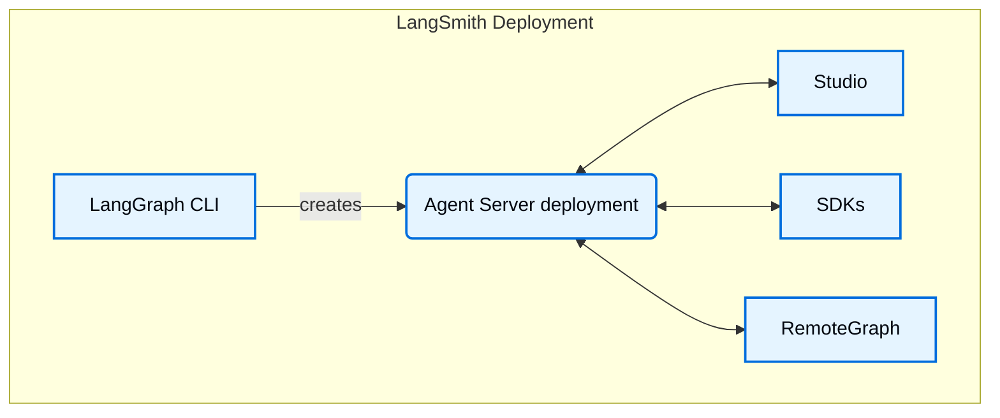

# LangSmith Deployment components

> Overview of Agent Server, LangGraph CLI, Studio, SDKs, RemoteGraph, control plane, and data plane components.

A [LangSmith Deployment](deployment.md) installation includes several key components. Together these tools and services provide a complete solution for building, deploying, and managing graphs (including agentic applications), whether on [Cloud](cloud.md) or in your own [self-hosted](self-hosted.md) infrastructure:

* [Agent Server](agent-server.md): Defines an opinionated API and runtime for deploying graphs and agents. Handles execution, state management, and persistence so you can focus on building logic rather than server infrastructure.
* [LangGraph CLI](cli.md): A command-line interface to build, package, and interact with graphs locally and prepare them for deployment.
* [Studio](studio.md): A specialized IDE for visualization, interaction, and debugging. Connects to a local Agent Server for developing and testing your graph.
* [Python/JS SDK](reference.md): The Python/JS SDK provides a programmatic way to interact with deployed graphs and agents from your applications.
* [RemoteGraph](use-remote-graph.md): Allows you to interact with a deployed graph as though it were running locally.
* [Control Plane](control-plane.md): The UI and APIs for creating, updating, and managing Agent Server deployments.
* [Data plane](data-plane.md): The runtime layer that executes your graphs, including Agent Servers, their backing services (PostgreSQL, Redis, etc.), and the listener that reconciles state from the control plane.

***

> [!NOTE]
> [Connect these docs](../use-these-docs.md) to Claude, VSCode, and more via MCP for real-time answers.

> [!NOTE]
> [Edit this page on GitHub](https://github.com/langchain-ai/docs/edit/main/src/langsmith/components.mdx) or [file an issue](https://github.com/langchain-ai/docs/issues/new/choose).
