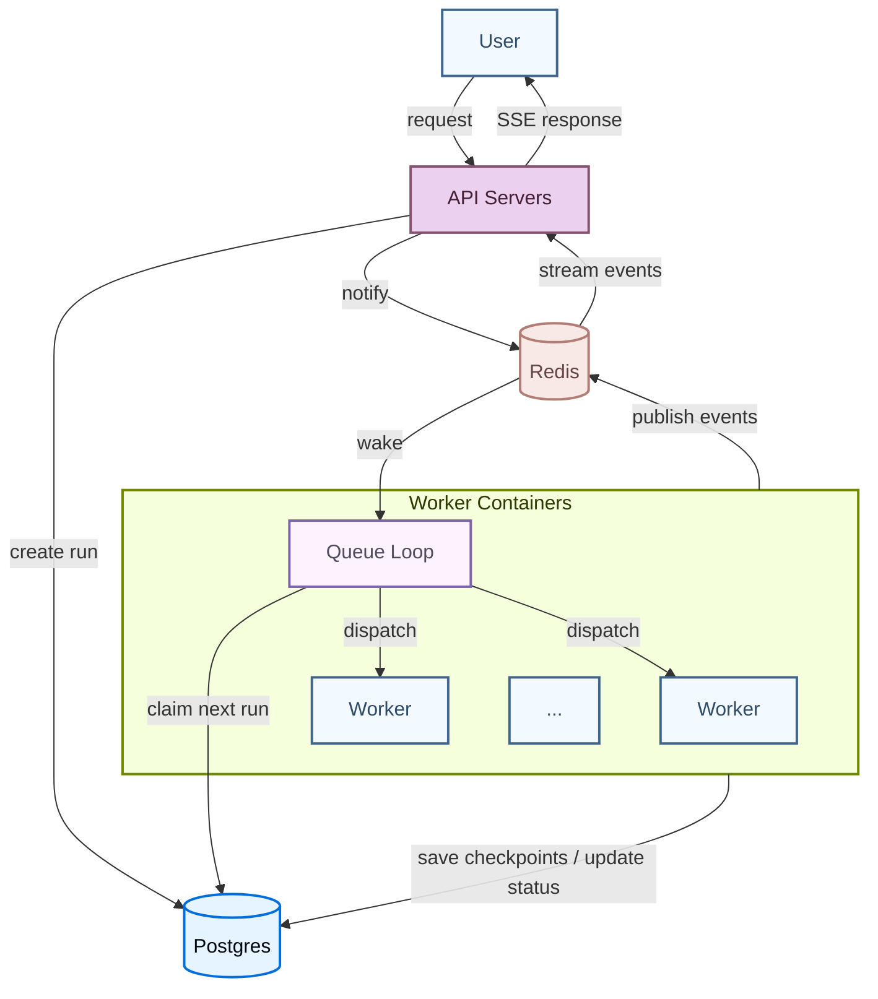

# Agent Server

LangSmith Deployment's **Agent Server** offers an API for creating and managing agent-based applications. It is built on the concept of [assistants](assistants.md), which are agents configured for specific tasks, and includes built-in [persistence](../langgraph/persistence.md#memory-store) and a [task queue](#task-queue). This versatile API supports a wide range of agentic application use cases, from background processing to real-time interactions.

Use Agent Server to create and manage:

#### [Assistants](assistants.md)

#### [Threads](use-threads.md)

#### [Runs](runs.md)

#### [Cron jobs](cron-jobs.md)

> [!TIP]
> **API reference** 
> For detailed information on the API endpoints and data models, refer to the [Agent Server API reference](server-api-ref.md).

## Application structure

To deploy an Agent Server application, you need to specify the graph(s) you want to deploy, as well as any relevant configuration settings, such as dependencies and environment variables.

Read the [application structure](application-structure.md) guide to learn how to structure your LangGraph application for deployment.

> [!NOTE]
> [LangSmith cloud](cloud.md) manages the database for you. If you're deploying on your [own infrastructure](self-hosted.md), you'll need to set it up yourself.

## Parts of a deployment

When you deploy Agent Server, you are deploying one or more [graphs](#graphs), a database for [persistence](../langgraph/persistence.md), and a [task queue](#task-queue).

### Graphs

When you deploy a graph with Agent Server, you are deploying a "blueprint" for an [Assistant](assistants.md).

A graph most commonly implements an [agent](../langgraph/workflows-agents.md), but it does not have to. For example, a graph could implement a simple chatbot that only supports back-and-forth conversation, without the ability to influence any application control flow. In reality, as applications get more complex, a graph will often implement a more complex flow that may use [multiple agents](../langchain/multi-agent.md) working in tandem.

Graphs don't have to be written with LangGraph. You can also deploy agents built with other frameworks—such as [Strands, Claude Agent SDK, and more](deploy-other-frameworks.md) or [Google ADK](deploy-google-adk.md)—using the LangGraph Functional API or the `deployments-wrap-sdk` package.

#### Graph loading and compilation

How and when your graph is compiled depends on how you register it in your [application structure](application-structure.md):

1. **Compiled graph** (recommended): Export an already-compiled `CompiledGraph` instance. The server loads it once at container startup and reuses it for every run—no compilation overhead per request.
2. **Factory function**: Export an agent factory function that the server invokes each time it needs the graph. Use this only when you need per-run graph customization (for example, choosing different models or tools based on the assistant config). Keep factory functions lightweight, since they run on every invocation.

> [!TIP]
> Use a compiled graph unless you specifically need per-run customization. Factory functions add overhead on every invocation; compiled graphs do not.

In both cases, the server automatically injects the checkpointer and memory store configured for that deployment at runtime. **Do not configure these in your graph code** because the server needs to manage them for other operations.

### Persistence

Agent Server persists three types of data, all backed by [PostgreSQL](https://www.postgresql.org/) by default:

* **Core resource data**: assistants, threads, runs, and cron jobs. Always stored in PostgreSQL.
* **Checkpoints (short-term memory)**: snapshots of graph execution state written at each step. They make runs durable: if a worker is interrupted, the run can resume from the last checkpoint rather than from the beginning. Durability mode controls checkpoint frequency—`async` (default) writes after each step; `exit` stores only the final state. LangSmith stores this in PostgreSQL by default; but you can switch to [MongoDB](https://www.mongodb.com/) or a custom implementation. For details, refer to [Configure checkpointer backend](configure-checkpointer.md).
* **Store (long-term memory)**: memory that persists across threads, enabling agents to retain information between separate conversations. Stored in PostgreSQL by default but can be replaced with a custom implementation. For details, refer to [Add custom store](custom-store.md).

### Task queue

When a client creates a run, the API server enqueues it and a queue worker picks it up for execution. Workers can also be signaled to cancel a run in progress, and publish output events that open `/stream` connections forward to the client in real time.

[Redis](https://redis.io/) handles the signaling, cancellation, and streaming pub/sub between API servers and queue workers. It stores only ephemeral data—no user or run data persists in Redis. Run data itself is always read from and written to PostgreSQL.

For more information on how to set up and manage these components, review the [hosting options](platform-setup.md) guide.

## Runtime architecture

### Deployment modes

Agent Server supports three runtime configurations:

* **Single host**: The API server manages the task queue directly with no separate queue workers. This is the default for self-hosted deployments and is suitable for development and low-traffic use cases.
* **Split API and queue**: Dedicated queue workers handle run execution on separate hosts from the API server. For self-hosted deployments, enable this by setting `queue.enabled: true` in your configuration. Each tier scales independently—API servers scale on request volume, queue workers scale on pending run count.
* **Distributed runtime**: The API and queue processes are again run separately, but instead of a single queue process handling both the orchestration and execution of your graph, the distributed runtime uses one process for orchestration and one process for execution. Use this for large-scale deployments with high concurrency requirements.

The container architecture and run lifecycle described below apply to single host and split API and queue configurations.

### Container architecture

A typical deployment consists of two kinds of long-running containers, both built from the same Docker image (a base image with your project code installed on top):

* **API servers** handle client requests (creating runs, reading thread state, streaming results) but do not execute agent code themselves.
* **Queue workers** are the execution engine. They listen to the durable task queue, execute your graph code, and write checkpoints.

Containers are **stateless** but persistent. At least 1 queue worker must listen to the task queue at any time to ensure no runs are orphaned. The containers can serve many runs over their lifetime.

API servers and queue workers are separate container pools and [scale independently](data-plane.md#autoscaling).

### Run execution lifecycle

When you invoke a run, the request flows through several components:

1. A client sends a request to an API server, which creates a pending run in the durable task queue.
2. A queue worker picks up the run, acquires a lease on it, loads the appropriate graph, and begins execution. The queue enforces that at most 1 run can be executed for a given thread at one time.
3. As the graph executes, the worker writes checkpoints to the persistence layer (the frequency depends on the [durability mode](../langgraph/persistence.md#durability-modes)) and broadcasts streaming events over the configured pubsub provider.
4. If the client opened a `/stream` connection, the API server subscribes to the pubsub channel and forwards events to the client via server-sent events in real time.
5. When execution completes, the worker updates the run status and releases its slot for the next run.

Each worker executes up to [`N_JOBS_PER_WORKER`](env-var-self-hosted.md) runs concurrently (default: 10), so a single worker container serves many runs in parallel. This bounds concurrent run execution, not the number of API requests the deployment can serve. API servers handle requests independently and scale separately, so request-serving capacity is not capped by `N_JOBS_PER_WORKER`. See [Configure Agent Server for scale](agent-server-scale.md) for tuning guidance.

## Learn more

* [Application Structure](application-structure.md) guide explains how to structure your application for deployment.
* The [API Reference](server-api-ref.md) provides detailed information on the API endpoints and data models.

***

> [!NOTE]
> [Connect these docs](../use-these-docs.md) to Claude, VSCode, and more via MCP for real-time answers.

> [!NOTE]
> [Edit this page on GitHub](https://github.com/langchain-ai/docs/edit/main/src/langsmith/agent-server.mdx) or [file an issue](https://github.com/langchain-ai/docs/issues/new/choose).
