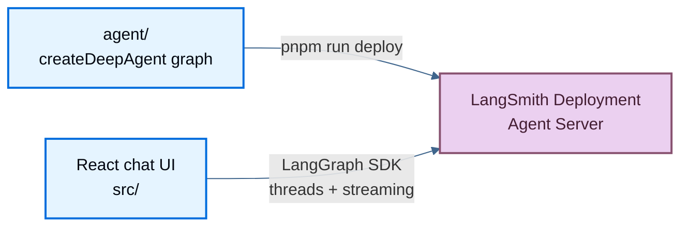

# Deploy with LangSmith and Vite

> Deploy a LangChain deep agent to LangSmith Deployment and stream from a Vite React chat UI on Vercel, Netlify, or Cloudflare Pages.

This example gets you from a local checkout to a deployed LangChain deep agent with a working chat UI. The backend runs as a [LangSmith Deployment](deployment.md), and the frontend is a Vite + React app that streams from it.

Use this guide when you want to run the agent locally, deploy it to LangSmith, and point the UI at the deployed Agent Server.

Source: [`js-langsmith`](https://github.com/langchain-ai/deployment-cookbook/tree/main/js-langsmith) in the deployment cookbook.

## What you are deploying

A **LangSmith Deployment** runs a LangGraph graph on LangSmith's hosted Agent Server. In this example:

* `agent/` contains the deep agent graph, subagents, middleware, and tools.
* `langgraph.json` tells the LangGraph CLI which graph to serve and deploy.
* `src/` contains the React chat UI.
* The UI talks to the Agent Server API through the LangGraph SDK and `@langchain/react`.

The deployed agent is a coordinator with two subagents:

* `researcher` uses the local `search_web` tool.
* `math-whiz` uses the local `calculator` tool.

### How the pieces fit



During local development, `pnpm run dev` starts both the LangGraph dev server and the Vite app. In production, LangSmith hosts the agent and a static host serves the Vite-built UI.

### Prerequisites

* A [LangSmith API key](create-account-api-key.md) with deployment access.
* An OpenAI API key for the agent model.
* `pnpm`.

## Run locally

### Install dependencies
```bash
cd js-langsmith
pnpm install
```

### Create your environment file
```bash
cp .env.example .env
```

Open `.env` and set:

```bash
OPENAI_API_KEY=<your OpenAI API key>
```

Leave `LANGSMITH_API_KEY` and `VITE_AGENT_API_URL` empty for local development. You only need `LANGSMITH_API_KEY` when deploying or testing the UI against a remote LangSmith deployment.

### Start the agent and UI
```bash
pnpm run dev
```

This starts both processes:

* LangGraph dev server at [http://localhost:2024](http://localhost:2024).
* Vite dev server at [http://localhost:5173](http://localhost:5173).

### Open the chat
Open [http://localhost:5173](http://localhost:5173). Try a prompt that uses both subagents:

```text
Research LangGraph streaming, and separately calculate 42 * 17.
```

When `VITE_AGENT_API_URL` is empty, the Vite app uses its local proxy at `/api/langgraph`, which forwards requests to the LangGraph dev server and avoids CORS issues.

## Deploy the agent to LangSmith

### Confirm your environment
Your `.env` must include:

```bash
OPENAI_API_KEY=<your OpenAI API key>
LANGSMITH_API_KEY=<your LangSmith API key>
```

Optionally set a deployment name:

```bash
LANGSMITH_DEPLOYMENT_NAME=deployment-cookbook-agent
```

If `LANGSMITH_DEPLOYMENT_NAME` is unset, the deployment name defaults to the directory name.

### Deploy the agent to LangSmith
```bash
pnpm run deploy
```

This runs `langgraphjs deploy`. The CLI uses `langgraph.json` to deploy the `agent` graph from `agent/index.ts`.

### Copy the deployment API URL
After deploy, open the deployment in LangSmith and copy its **API URL**. It should look like:

```text
https://your-app.us.langgraph.app/
```

Use the root URL only. Do not add any API path suffix.

### Test the UI against the remote deployment
Set `VITE_AGENT_API_URL` in `.env`:

```bash
VITE_AGENT_API_URL=https://your-app.us.langgraph.app
```

Then run the UI:

```bash
pnpm run dev
```

The browser client reuses `LANGSMITH_API_KEY` when talking to the remote deployment.

> [!WARNING]
> The demo exposes `LANGSMITH_API_KEY` to the browser bundle so the UI can call the LangSmith deployment directly. That is convenient for local testing, but not production-safe. For a real app, proxy requests through your own backend and keep the key server-side.

## Deploy the frontend

The agent and the UI deploy separately. After `pnpm run deploy` succeeds, host the Vite build (`dist/`) on any static platform and point it at your LangSmith deployment URL.

#### Vercel
### Import the repository
Click **Deploy with Vercel** below, or import [`langchain-ai/deployment-cookbook`](https://github.com/langchain-ai/deployment-cookbook) manually.

<a href="https://vercel.com/new/clone?repository-url=https%3A%2F%2Fgithub.com%2Flangchain-ai%2Fdeployment-cookbook&root-directory=js-langsmith&env=VITE_AGENT_API_URL,LANGSMITH_API_KEY&envDescription=LangSmith%20deployment%20URL%20and%20API%20key" target="_blank" rel="noopener noreferrer">
  
</a>

### Configure the project
1. Set **Root Directory** to `js-langsmith`.
2. Use the default Vite build. The build output is `dist/`.
3. Set these environment variables:
   * `VITE_AGENT_API_URL`: the LangSmith deployment root URL.
   * `LANGSMITH_API_KEY`: the LangSmith API key used by the demo client.

#### Netlify
### Import the repository
Click **Deploy to Netlify** below, or import [`langchain-ai/deployment-cookbook`](https://github.com/langchain-ai/deployment-cookbook) manually.

<a href="https://app.netlify.com/start/deploy?repository=https://github.com/langchain-ai/deployment-cookbook&base=js-langsmith" target="_blank" rel="noopener noreferrer">
  
</a>

### Configure the project
Set **Base directory** to `js-langsmith`. Use the default build command (`pnpm build` or `npm run build`) and publish directory `dist/`.

### Set environment variables
Add these variables in Netlify before deploying:

* `VITE_AGENT_API_URL`: the LangSmith deployment root URL.
* `LANGSMITH_API_KEY`: the LangSmith API key used by the demo client.

#### Cloudflare Pages
### Connect the repository
In the [Cloudflare dashboard](https://dash.cloudflare.com/), create a **Workers & Pages** project from [`langchain-ai/deployment-cookbook`](https://github.com/langchain-ai/deployment-cookbook).

### Configure the build
* **Root directory**: `js-langsmith`
* **Build command**: `pnpm install && pnpm build`
* **Build output directory**: `dist`

### Set environment variables
Add these variables in the Pages project settings:

* `VITE_AGENT_API_URL`: the LangSmith deployment root URL.
* `LANGSMITH_API_KEY`: the LangSmith API key used by the demo client.

## Troubleshooting

* `pnpm run dev` starts but the UI cannot connect: leave `VITE_AGENT_API_URL` empty for local dev, then restart `pnpm run dev`.
* The agent fails to answer locally: confirm `OPENAI_API_KEY` is set in `.env`.
* `pnpm run deploy` fails with an auth error: confirm `LANGSMITH_API_KEY` has deployment access.
* The remote UI fails to connect: confirm `VITE_AGENT_API_URL` is the deployment root URL with no path suffix.
* Threads disappear after restarting local dev: local `langgraph dev` uses the in-memory `MemorySaver`; LangSmith Deployment provides durable storage in production.
* You changed files in `agent/` but production did not change: run `pnpm run deploy` again.

## Learn about the project

<details>
<summary>Agent files</summary>

The LangSmith backend lives in `agent/`:

```text
agent/
├── index.ts       # createDeepAgent graph
├── middleware.ts  # response middleware
└── tools.ts       # custom code tools
```

`agent/index.ts` exports the graph that LangGraph serves locally and LangSmith deploys. The local `MemorySaver` checkpointer is only used by `langgraph dev`. LangSmith Deployment replaces it with durable Postgres-backed storage in production without code changes.

</details>

<details>
<summary>LangGraph config</summary>

`langgraph.json` points the CLI at the graph:

```json
{
  "graphs": {
    "agent": "./agent/index.ts:agent"
  },
  "env": ".env"
}
```

The graph id is `agent`. The frontend uses that id as the assistant id when streaming.

</details>

<details>
<summary>Chat UI</summary>

The React app in `src/` provides streaming chat, thread history, subagent rendering, and tool-call rendering.

The frontend uses:

* `client.threads.search()` for the thread sidebar.
* `client.threads.create()` and `client.threads.delete()` for conversation management.
* `StreamProvider` with `assistantId: "agent"` for streaming chat.

See the [Agent Server API reference](server-api-ref.md) for the underlying thread and streaming APIs.

</details>

<details>
<summary>Local commands</summary>

Run both local processes:

```bash
pnpm run dev
```

Run them separately:

```bash
pnpm run dev:agent
pnpm run dev:web
```

Build and preview the frontend:

```bash
pnpm build
pnpm preview
```

</details>

<details>
<summary>CI/CD</summary>

The agent deploys via GitHub Actions when files under `js-langsmith/agent/` or shared config files change:

* Workflow: [`.github/workflows/deploy-langsmith-agent.yml`](https://github.com/langchain-ai/deployment-cookbook/blob/main/.github/workflows/deploy-langsmith-agent.yml)
* Action: `langgraphjs deploy` to LangSmith.
* Required secret: `LANGSMITH_API_KEY`.
* Optional variable: `LANGSMITH_DEPLOYMENT_NAME`.

The frontend deploys through your static host's Git integration (for example Vercel, Netlify, or Cloudflare Pages).

</details>

## See also

* [Frameworks and platforms overview](deploy-frameworks-and-platforms.md)
* [LangSmith Deployment overview](deployment.md)
* [LangGraph CLI](cli.md)
* [Deep Agents going to production](../deepagents/going-to-production.md)

***

> [!NOTE]
> [Connect these docs](../use-these-docs.md) to Claude, VSCode, and more via MCP for real-time answers.

> [!NOTE]
> [Edit this page on GitHub](https://github.com/langchain-ai/docs/edit/main/src/langsmith/deploy-vite-langsmith.mdx) or [file an issue](https://github.com/langchain-ai/docs/issues/new/choose).
