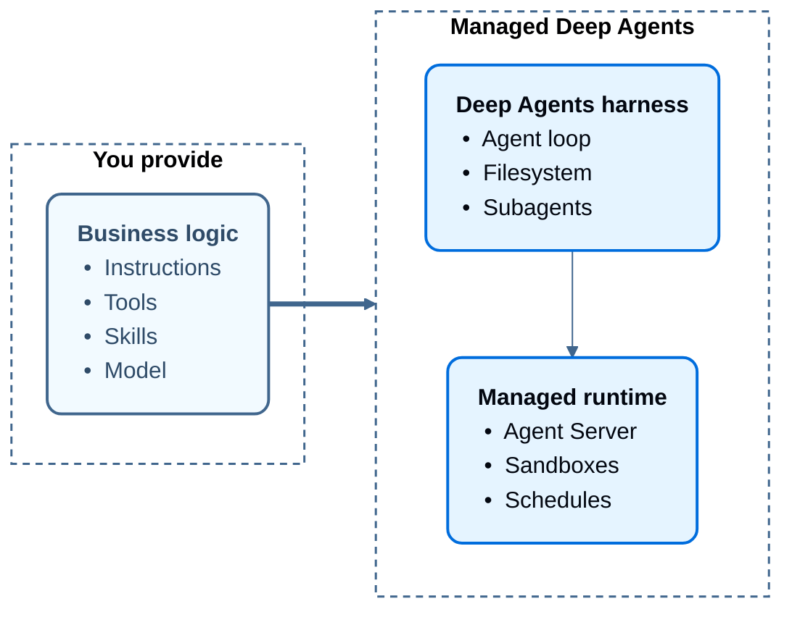

# Managed Deep Agents

> Build your agent as a directory of files while LangSmith runs the harness and runtime.

Managed Deep Agents (MDA) is the simplest way to build and deploy production agents. You focus on what your agent does. MDA runs it. There are no servers to run and no infrastructure to wire together.

You write the agent's intelligence: its instructions, the tools it can call, the skills it follows, and you select the model that drives it. MDA provides everything underneath:

* **The Deep Agents harness**: The agent loop that plans, calls tools, manages a filesystem, and delegates to subagents. See [Deep Agents](../../deepagents/overview.md).
* **A managed runtime**: Every deployment runs on [LangSmith Agent Server](../agent-server-overview.md). You get the Agent Server API, threads, runs, streaming, and the [MCP endpoint](managed-deep-agents-mcp-endpoint.md) without operating the server yourself.



## Example agent

A managed deep agent consists of a project folder that contains the business logic for its behavior:

#### Model & configuration
**agent.py**

```python
from managed_deepagents import define_deep_agent

from middleware.audit import log_tool_calls
from tools.search import internet_search

agent = define_deep_agent(
    name="research-assistant",
    model="openai:gpt-5.5",
    tools=[internet_search],
    middleware=[log_tool_calls],
)
```

#### Instructions
**instructions.md**

```markdown
# Assistant

You are a helpful assistant.
```

#### Skills
**skills/research/SKILL.md**

```markdown
---
name: research
description: Gather and synthesize context before answering complex questions.
---

# Research

Use this skill when a task needs more than a direct answer.

1. Identify what information is missing.
2. Search LangChain docs when the question is about LangChain, LangGraph, or LangSmith.
3. Summarize findings before responding to the user.
```

#### Tools
**tools/search.py**

```python
from langchain.tools import tool

@tool(parse_docstring=True)
def internet_search(query: str) -> str:
    """Search the internet for relevant sources.

    Args:
        query: The search query.
    """
    return f"Results for: {query}"
```

#### Middleware
**middleware/audit.py**

```python
from collections.abc import Awaitable, Callable

from langchain.agents.middleware import wrap_tool_call
from langchain.messages import ToolMessage
from langchain.tools.tool_node import ToolCallRequest
from langgraph.types import Command

@wrap_tool_call
async def log_tool_calls(
    request: ToolCallRequest,
    handler: Callable[[ToolCallRequest], Awaitable[ToolMessage | Command]],
) -> ToolMessage | Command:
    print(f"Calling tool: {request.tool_call['name']}")
    result = await handler(request)
    print(f"Finished tool: {request.tool_call['name']}")
    return result
```

#### MCP Connectors
**tools/mcp.py**

```python
from managed_deepagents import define_mcp

mcp = define_mcp(
    servers={
        "langchainDocs": {
            "transport": "http",
            "url": "https://docs.langchain.com/mcp",
            "include_tools": ["search_docs_by_lang_chain"],
        },
    },
)
```

When you upload this folder with the `mda` CLI, it will automatically run on managed LangSmith infrastructure.
You provide the business logic, and Managed Deep Agents provides the agent harness and production infrastructure.

To get started, see the [Managed Deep Agents quickstart](managed-deep-agents-quickstart.md).

## Core capabilities

Each part of the agent maps to a file or directory. Add the ones your agent needs:

| Capability                                                                        | Path              | Description                                                                              |
| --------------------------------------------------------------------------------- | ----------------- | ---------------------------------------------------------------------------------------- |
| [Model and configuration](managed-deep-agents-agent-definition.md) | `agent.py`        | The model and core options. Required.                                                    |
| [Instructions](managed-deep-agents-instructions.md)                | `instructions.md` | The system prompt that defines how the agent behaves.                                    |
| [Skills](managed-deep-agents-skills.md)                            | `skills/`         | Task-specific playbooks the agent loads when they are relevant.                          |
| [Tools](managed-deep-agents-tools.md)                              | `tools/`          | Functions the agent calls to run your application logic or reach external services.      |
| [MCP connectors](managed-deep-agents-mcp-connectors.md)            | `tools/mcp.py`    | Remote MCP servers that provide tools to the agent.                                      |
| [Middleware](managed-deep-agents-middleware.md)                    | `middleware/`     | Custom logic that runs around model and tool calls.                                      |
| [Sandbox](managed-deep-agents-sandboxes.md)                        | `sandbox/`        | An isolated filesystem and shell for running agent-written code.                         |
| [Memory](managed-deep-agents-memory.md)                            | `memory.py`       | Preferences and knowledge that persist across threads.                                   |
| [Identity](managed-deep-agents-identity.md)                        | `identity.py`     | Per-caller private threads, memory, and credentials for multi-user deployments.          |
| [Channels](managed-deep-agents-channels.md)                        | `channels/`       | Connections to messaging services, such as Slack, that start runs and receive responses. |
| [Schedules](managed-deep-agents-schedules.md)                      | `schedules/`      | Managed cron schedules that run the agent on a recurring basis.                          |
| [Evals](managed-deep-agents-evals.md)                              | `evals/`          | Harbor tasks that test the agent.                                                        |

For the full layout, see [Project structure](managed-deep-agents-project-structure.md). Instructions, skills, and optional durable memory are stored in [Context Hub](managed-deep-agents-context-hub.md).

## Next steps

#### [Quickstart](managed-deep-agents-quickstart.md)
Create and deploy your first Managed Deep Agent with the `mda` CLI.

#### [Tutorial](managed-deep-agents-tutorial.md)
Add a custom search tool, durable memory, and a daily schedule.

#### [Agent Server](../agent-server-overview.md)
Explore the runtime that hosts Managed Deep Agents deployments.

#### [MCP endpoint](managed-deep-agents-mcp-endpoint.md)
Call a deployed agent as a tool from Claude Code or another MCP client.

***

> [!NOTE]
> [Connect these docs](../../use-these-docs.md) to Claude, VSCode, and more via MCP for real-time answers.

> [!NOTE]
> [Edit this page on GitHub](https://github.com/langchain-ai/docs/edit/main/src/langsmith/managed-deep-agents-overview.mdx) or [file an issue](https://github.com/langchain-ai/docs/issues/new/choose).
