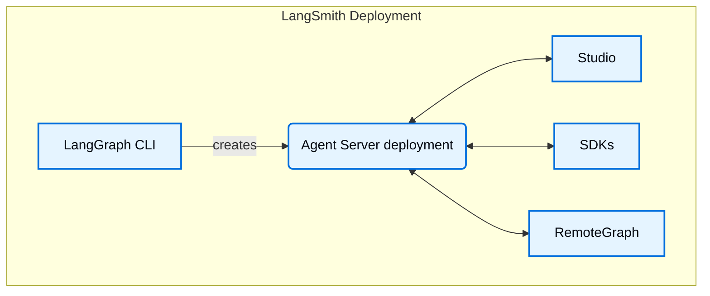

# LangSmith Studio

> [!NOTE]
> **Prerequisites**
>
> * [LangSmith](observability.md)
> * [Agent Server](agent-server.md)
> * [LangGraph CLI](cli.md)

Studio is a specialized agent IDE that enables visualization, interaction, and debugging of agentic systems that implement the Agent Server API protocol. Studio also integrates with [tracing](observability-concepts.md), [evaluation](evaluation.md), and [prompt engineering](prompt-context-hub.md#prompts).

## Features

Key features of Studio:

* Visualize your graph architecture
* [Run and interact with your agent](use-studio.md#run-application)
* [Manage assistants](use-studio.md#manage-assistants)
* [Manage threads](use-studio.md#manage-threads)
* [Iterate on prompts](observability-studio.md)
* [Run experiments over a dataset](observability-studio.md#run-experiments-over-a-dataset)
* Manage [long term memory](../concepts/memory.md)
* Debug agent state via [time travel](../langgraph/use-time-travel.md)
* 1 Click deploy to LangSmith Cloud.

Studio works for graphs that are deployed on [LangSmith](deployment-quickstart.md) or for graphs that are running locally via the [Agent Server](local-dev-testing.md).

Studio supports two modes:

### Graph mode

Graph mode exposes the full feature-set and is useful when you would like as many details about the execution of your agent, including the nodes traversed, intermediate states, and LangSmith integrations (such as adding to datasets and playground).

### Chat mode

Chat mode is a simpler UI for iterating on and testing chat-specific agents. It is useful for business users and those who want to test overall agent behavior. Chat mode is only supported for graph's whose state includes or extends [`MessagesState`](../langgraph/use-graph-api.md#messagesstate).

## Deploy from Studio

Go from [testing graphs locally](local-dev-testing.md) in Studio to deploying them on Langsmith Cloud in 1 Click, directly from Studio. You can use this to create a brand new deployment for quick prototyping or to redeploy an existing deployment.

## Learn more

* See this guide on how to [get started](quick-start-studio.md) with Studio.

## Video guide

> **Embedded Content:** [YouTube video player](https://www.youtube.com/embed/Mi1gSlHwZLM?si=oWCeHQ640zPHoLwn)

***

> [!NOTE]
> [Connect these docs](../use-these-docs.md) to Claude, VSCode, and more via MCP for real-time answers.

> [!NOTE]
> [Edit this page on GitHub](https://github.com/langchain-ai/docs/edit/main/src/langsmith/studio.mdx) or [file an issue](https://github.com/langchain-ai/docs/issues/new/choose).
